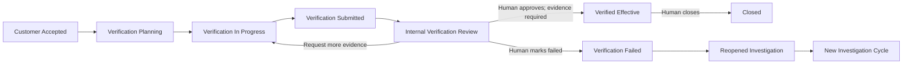

# PR-G7 Effectiveness Verification

## State machine

The compatibility status `effectiveness_verification` can only migrate to
`verification_planning`; it cannot close directly. A supplier may plan,
execute, attach evidence, and submit. Only a coordinator or authorized internal
member may review, approve, fail, or close.

## Data model and lifecycle

`quality_case_verification_cycles` owns append-only numbered cycles under a
Quality Case. Plans and executions are one-to-one with a cycle; a result is
one-to-one with an execution. Verification evidence is a required link between
a result and existing Case evidence, so no verification attachment is stored
without a result reference. Reviews and audits are append-only. Coach runs keep
the prompt identifier/version, input hash, response, confidence, policy outcome,
and generated time.

Active-cycle drafts follow the Case lifecycle. Plans, executions, results,
evidence links, reviews, audits, and accepted Coach runs remain with the Case
after closure. A failed cycle is immutable historical evidence; a later cycle
receives a new `cycle_number` and never overwrites it. Deleting a Case follows
the existing Case retention/deletion boundary; evidence objects remain governed
by the existing object-storage retention policy.

The additive migration is `drizzle/0012_effectiveness_verification.sql`; its
dedicated rollback removes only PR-G7 tables. Neither migration references
ReportData, D0-D8, exports, payment, or marketing data.

## Permission matrix

| Actor | View | Modify / submit | Forbidden |
| --- | --- | --- | --- |
| Supplier token participant | Current Case context, current cycle plan/result, its linked evidence | Plan, execution, result, evidence, submit | Approve, fail, close, reopen, other Cases |
| Coordinator / Case owner | All cycles, internal reviews, audits, Coach advice | Plan, execute, request evidence, approve/fail, close, create/revoke supplier link | Bypass workflow or overwrite old cycles |
| Customer | Only a separately authorized verification projection and authorized evidence | None | Internal risks, Coach runs, supplier drafts, modification, close |
| AI Verification Coach | The bounded current verification snapshot supplied by the service | Suggest, warn, recommend | Approve, reject, decide effectiveness, close, reopen, state mutation |

## AI Verification Coach

Prompt identity is `quality-verification-coach@g7-v1`. The Coach checks required
plan fields, sampling scope, result detail, and evidence presence. Its output is
limited to `missing`, `warnings`, and `suggestions`, with `advisoryOnly: true`.
Policy validation rejects decision or workflow keys such as `approved`,
`confirmedEffective`, `closeCase`, `reopenCase`, and `workflowTransition`.
The current implementation is deterministic and makes no external model call.

## API boundaries

- Internal: `/api/quality-cases/[id]/verification` and
  `/api/quality-cases/[id]/verification/evidence`.
- Supplier: `/api/verification-tasks/[token]` and its `/evidence` child.
- Tokens are random, stored only as SHA-256 hashes, Case-bound, expiring, and
  revocable. Completed links remain read-only until expiry.
- Every domain query retains a Case/Cycle or Case/Result relationship check.
- Evidence upload writes the Case evidence row and verification-result link in
  one database batch.

## UI verification

- Desktop: `output/playwright/pr-g7/verification-desktop.png`
- Mobile: `output/playwright/pr-g7/verification-mobile.png`

Real Chromium rendered the supplier workspace at 1440×1000 and 390×844 with a
non-production intercepted fixture. Mobile horizontal overflow check passed.
The only browser-console errors were the expected unavailable local Vercel
Insights script; no application error was observed.

## Test and smoke status

Unit/contract/security regression, TypeScript, scoped ESLint, and the production
build pass. The authenticated smoke script now covers plan, execution, evidence,
submission, human approval, close, and reopen. The migration rehearsal includes
up, idempotent re-run, scoped rollback, and re-apply for PR-G7.

No disposable database or test object-storage credentials are configured in the
current environment. The database rehearsal correctly refused to run without
`SMOKE_DB=true`; therefore no production database was contacted. Executing the
prepared database/authenticated smoke remains a release-candidate gate.

## Release candidate recommendation

Do not add another feature PR after PR-G7. Move to a Release Candidate phase:
provision a disposable database and object-storage bucket, run the migration and
normal/failure lifecycle smoke, complete three-role usability testing, polish
copy and accessibility, prepare the demo, and perform commercial launch review.
