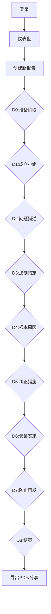
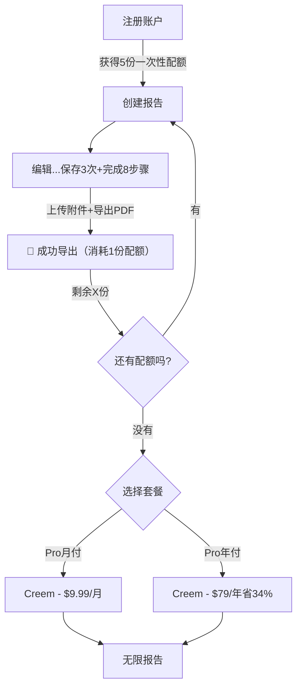
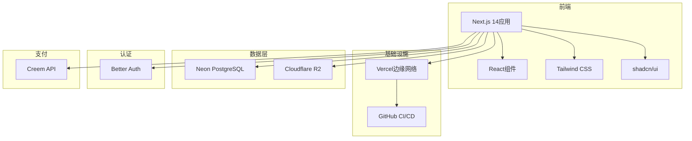

# 8D报告创建工具 - 产品需求文档

---

## 🔴 Phase 1 MVP（4.5周，2025年5月-6月）

### ✅ 批准范围（仅以下内容先做）
| 功能 | 说明 |
|------|------|
| **认证系统** | 邮箱 + OAuth（Google/GitHub）登录 |
| **通用8D表单** | 仅1个通用模板，完整D0-D8 |
| **PDF导出** | 报告导出为PDF |
| **报告列表 + 查看** | 个人报告列表 |
| **分享链接** | 只读分享链接 |
| **基础定价** | 免费版5份/月（带水印），Pro版$9.99/月（无限无水印） |

---

## ⏸️ Phase 2（后续迭代）
以下功能暂不开发，保留完整设计供后续使用：
- SCAR管理
- 索赔管理
- 看板视图
- 甘特图
- PWA离线功能
- 团队协作功能
- 自定义模板构建器
- Excel导出
- 报告编号配置
- 问题升级机制
- 横向展开
- SPC控制图
- 供应商数据库
- 多语言支持
- 主机厂专用模板（福特/大众/通用）

---

## 1. 产品概述

**8D报告创建工具**是一款面向全球用户的云端解决方案，专为质量工程团队提供8D报告创建、协作编辑和专业导出功能。该Web应用让现场技术人员和质量工程师能够直接在移动设备上记录问题、拍照取证并完成8D报告——彻底告别"现场拍照→回办公室上传照片→手动填写Excel模板"的繁琐流程。

### 1.1 目标市场
- **主要用户**：质量工程师（所有制造业）、中小微企业质量团队
- **次要用户**：现场技术人员、项目经理
- **地理区域**：全球市场（英语优先）

### 1.2 产品价值
- **高效**：现场完成8D报告，支持拍照和实时数据录入
- **易用**：在任何设备（手机、平板、电脑）上都能使用
- **安全**：企业级数据保护，支持行级安全策略

### 1.3 技术栈
- **前端**：Next.js 14 App Router + React 18 + Tailwind CSS + shadcn/ui
- **部署**：Vercel（与GitHub集成CI/CD）
- **数据库**：Neon（Serverless PostgreSQL）
- **ORM**：Drizzle ORM
- **认证**：Better Auth（JWT）
- **存储**：Cloudflare R2（兼容S3）
- **支付**：Creem（Stripe备用）
- **状态管理**：React Server Components + 客户端zustand
- **富文本**：TipTap
- **日期处理**：date-fns

---

## 2. 核心功能

### 2.1 用户角色与定价
| 套餐 | 价格 | 报告数量 | 附件限制 | 功能 |
|------|------|---------|---------|------|
| 免费版 | $0 | 5份（一次性，水印） | 5MB/个，20MB/报告 | 通用8D模板、PDF导出、分享链接 |
| Pro月付 | $9.99/月 | 无限 | 10MB/个，100MB/报告 | 无水印、优先支持 |
| Pro年付 | **$79/年** | 无限 | 10MB/个，100MB/报告 | 同Pro月付，省34% |

**配额机制（老板要求）**：
- 免费5份为**一次性配额**（注册即得，不重置）
- 必须**完整使用清楚**才算消耗1份配额：
  1. 完成8D所有8个步骤
  2. 至少填写50%必填字段
  3. 至少上传1张附件
  4. 导出PDF
  5. 至少保存3次
- 防白嫖：邮箱验证 + IP注册限制 + 临时邮箱屏蔽

**财务安全**：固定成本$85/月，盈亏平衡仅需10个付费用户。

### 2.2 功能模块（Phase 1）
1. **认证页面**：注册、登录、密码重置、邮箱验证
2. **仪表盘**：报告列表
3. **报告创建向导**：类型选择→D0→D8
4. **报告查看/编辑**：完整报告展示
5. **个人中心**：用户资料、订阅管理

### 2.3 页面详情（Phase 1）
| 页面 | 模块 | 功能描述 |
|------|------|----------|
| 落地页 | Hero、功能介绍、定价、CTA | 用于获取用户的营销页面 |
| 认证 | 登录、注册、忘记密码 | 邮箱 + OAuth（Google、GitHub） |
| 仪表盘 | 报告列表 | 个人报告列表 |
| 报告创建向导 | D0-D8分步 | 进度指示器、自动保存 |
| 报告视图 | 展示、编辑 | 可折叠章节、附件预览 |
| 分享链接 | 只读查看 | 无需登录访问 |
| 个人中心 | 用户信息、订阅 | Creem集成用于升级 |

### 2.4 8D标准步骤（通用行业）
选择模板后，D0-D8的内容根据模板动态渲染：
```
D0: 准备阶段 - 接收问题通知、评估是否启动8D、紧急响应、分配报告编号、录入报告级元数据
D1: 成立小组 - 团队成员、职责分工
D2: 问题描述 - IS/IS NOT（可选）、问题现象、零件追溯、现场照片
D3: 临时遏制措施 - 保护客户的即时行动、有效期、在途/在库/出货统计、验证证据
D4: 根本原因分析 - 5个为什么、鱼骨图、发生/流出/系统原因、验证计划
D5: 永久纠正措施 - 长期解决方案、成本估算
D6: 实施与验证 - 行动计划、验证数据、证据
D7: 防止再发 - 系统性变更、控制计划更新、横向展开、培训
D8: 结案与表彰 - 自动完成核查、经验教训、审批
```

### 2.5 内置模板
| 模板名称 | 适用场景 | 特点 |
|---------|---------|------|
| **通用8D报告** | 所有行业/内部改善 | 默认选中，简洁无汽车术语 |

---

## 3. 用户流程

### 3.1 主要流程：创建8D报告


### 3.2 订阅流程


---

## 4. UI设计

### 4.1 设计系统
**配色方案**：
```
主色:        #165DFF (蓝色 - 信任、专业)
辅助色:      #36D399 (绿色 - 成功、成长)
强调色:      #FF6B35 (橙色 - 行动、注意)
背景色:      #FFFFFF (浅色) / #0F172A (深色)
表面色:      #F8FAFC (浅色) / #1E293B (深色)
主要文字:    #1E293B (浅色) / #F8FAFC (深色)
次要文字:    #64748B
边框色:      #E2E8F0 (浅色) / #334155 (深色)
```

**字体排版**：
```
字体族: Inter (主字体), system-ui (备选)
标题:   600-700 字重
正文:   400-500 字重
字号:   12/14/16/18/20/24/30/36/48px
```

**组件** (shadcn/ui)：
- 按钮：圆角 (rounded-lg)，微妙阴影
- 卡片：白色/表面色，柔和边框，悬停提升效果
- 表单：简洁输入框，清晰标签，内联验证
- 导航：粘性顶部栏，移动端抽屉菜单

### 4.2 响应式设计
**断点**：
```
移动端:  < 640px   (单列布局，触摸优化)
平板:    640-1024px (自适应网格，滑动手势)
桌面端:  > 1024px   (多列布局，键盘快捷键)
```

**移动端优先特性**：
- 相机访问用于即时拍照
- 滑动手势切换步骤
- 大触摸目标（最小44px）
- 底部导航栏

### 4.3 UI交互规范与按钮位置

#### 报告创建向导流程
| 步骤 | 内容 | 按钮位置 | 说明 |
|------|------|----------|------|
| 1 | **D0:准备阶段** | 分步表单 | 报告编号生成、元数据填写 |
| 2-9 | **D1-D8** | 左侧导航 + 顶部进度条 | 点击导航切换，自动保存 |

#### 报告编辑页UI布局
| 区域 | 内容 | 说明 |
|------|------|------|
| **顶部栏** | 报告标题、编号、状态、右侧操作按钮 | 操作按钮：保存、导出、分享、提交审批 |
| **左侧导航** | D0-D8步骤列表 + 进度指示器 | 当前步骤高亮，完成步骤打勾 |
| **主内容区** | 当前步骤表单 + 附件上传 | 表单支持富文本，照片支持相机直接拍 |
| **底部栏（移动端）** | 保存、下一步、上一步 | 固定在底部 |

#### 按钮优先级与位置
- **主要操作**：右上角或底部，蓝色主色，最小44x44px（移动端）
  - 保存、提交审批、下一步
- **次要操作**：灰色，在主要操作旁边
  - 上一步、预览
- **三级操作**：更多菜单（⋮）
  - 复制报告、删除

#### 字段必填性策略
| 模式 | 默认必填字段 | 说明 |
|------|-------------|------|
| **通用行业** | 问题描述、临时措施、根本原因 | 其他可选，降低使用门槛 |

---

## 5. 技术架构

### 5.1 系统架构


### 5.2 路由结构
```
/ → 落地页（营销）
/login → 登录
/signup → 注册
/dashboard → 仪表盘
/reports → 报告列表
/reports/new → 创建报告向导（D0-D8）
/reports/:id → 查看/编辑报告
/profile → 用户资料
/pricing → 订阅套餐
/share/:token → 报告分享链接（无需登录）
```

### 5.3 API设计
```
# 认证（通过Better Auth）
POST /api/auth/signup
POST /api/auth/login
POST /api/auth/logout
POST /api/auth/reset-password

# 报告
GET    /api/reports → 列出用户报告
POST   /api/reports → 创建报告
GET    /api/reports/:id → 获取报告
PUT    /api/reports/:id → 更新报告
DELETE /api/reports/:id → 删除报告
GET    /api/reports/:id/share-link → 生成分享链接

# 附件
POST   /api/attachments/upload → 上传附件

# 订阅（通过Creem）
GET    /api/subscription → 获取当前订阅
POST   /api/subscription/create → 创建结账会话
POST   /api/webhooks/creem → 处理Creem webhook

# 导出
POST   /api/reports/:id/export/pdf → 生成PDF
```

---

## 6. 数据模型

### 6.1 ER图
```mermaid
erDiagram
    USERS ||--o{ REPORTS : creates
    USERS ||--o{ SUBSCRIPTIONS : has
    REPORTS ||--o{ ATTACHMENTS : has
    REPORTS ||--o{ REPORT_SHARES : has
    TEMPLATES ||--o{ REPORTS : uses
    SUBSCRIPTIONS ||--o| PLANS : subscribes_to

    USERS {
        uuid id PK
        string email
        string name
        string avatar_url
        string auth_provider
        timestamp email_verified_at
        timestamp created_at
    }

    SUBSCRIPTIONS {
        uuid id PK
        uuid user_id FK
        string plan_id
        string creem_subscription_id
        string status
        timestamp current_period_start
        timestamp current_period_end
        boolean cancel_at_period_end
        int reports_used_this_period
        timestamp created_at
    }

    PLANS {
        uuid id PK
        string creem_product_id
        string name
        decimal price_monthly
        int reports_per_month
        boolean is_active
    }

    REPORTS {
        uuid id PK
        uuid user_id FK
        uuid template_id FK
        string title
        string status
        string report_type
        jsonb data
        jsonb step_status
        int report_number serial
        timestamp created_at
        timestamp updated_at
    }

    TEMPLATES {
        uuid id PK
        uuid creator_id FK
        string name
        string type
        jsonb structure
        boolean is_default
        boolean is_public
        int usage_count
        timestamp created_at
    }

    ATTACHMENTS {
        uuid id PK
        uuid report_id FK
        string step_id
        string storage_path
        string url
        string filename
        string file_type
        int file_size
        timestamp created_at
    }

    REPORT_SHARES {
        uuid id PK
        uuid report_id FK
        uuid shared_by FK
        string permission_level
        string access_token
        timestamp expires_at
        timestamp created_at
    }
```

### 6.2 数据库Schema（PostgreSQL DDL）
```sql
-- 启用UUID扩展
create extension if not exists "uuid-ossp";

-- ====================
-- 核心用户与认证表
-- ====================

-- 用户表
create table public.users (
    id uuid primary key default uuid_generate_v4(),
    email text unique not null,
    name text,
    avatar_url text,
    auth_provider text default 'email',
    email_verified_at timestamp with time zone,
    created_at timestamp with time zone default timezone('utc'::text, now()) not null,
    updated_at timestamp with time zone default timezone('utc'::text, now()) not null
);

-- 套餐表
create table public.plans (
    id uuid primary key default uuid_generate_v4(),
    creem_product_id text unique not null,
    name text not null,
    description text,
    price_monthly numeric(10,2),
    price_yearly numeric(10,2),
    reports_per_month int default -1,
    max_team_members int default 1,
    features jsonb default '[]',
    is_active boolean default true,
    created_at timestamp with time zone default timezone('utc'::text, now()) not null
);

-- 订阅表
create table public.subscriptions (
    id uuid primary key default uuid_generate_v4(),
    user_id uuid references public.users(id) on delete cascade not null,
    plan_id uuid references public.plans(id),
    creem_subscription_id text unique,
    creem_customer_id text,
    status text not null default 'trialing',
    current_period_start timestamp with time zone,
    current_period_end timestamp with time zone,
    cancel_at_period_end boolean default false,
    reports_used_this_period int default 0,
    created_at timestamp with time zone default timezone('utc'::text, now()) not null,
    updated_at timestamp with time zone default timezone('utc'::text, now()) not null
);

-- 模板表
create table public.templates (
    id uuid primary key default uuid_generate_v4(),
    creator_id uuid references public.users(id),
    name text not null,
    description text,
    type text not null,
    category text,
    structure jsonb not null,
    settings jsonb default '{}',
    is_default boolean default false,
    is_public boolean default false,
    is_ai_generated boolean default false,
    usage_count int default 0,
    created_at timestamp with time zone default timezone('utc'::text, now()) not null,
    updated_at timestamp with time zone default timezone('utc'::text, now()) not null
);

-- 报告表
create table public.reports (
    id uuid primary key default uuid_generate_v4(),
    user_id uuid references public.users(id) on delete cascade not null,
    template_id uuid references public.templates(id),
    title text not null,
    status text not null default 'draft',
    report_type text not null default 'customer_8d',
    priority text not null default 'medium',
    source text,
    supplier_name text,
    data jsonb not null default '{}',
    step_status jsonb default '{}',
    metadata jsonb default '{}',
    report_number serial,
    created_at timestamp with time zone default timezone('utc'::text, now()) not null,
    updated_at timestamp with time zone default timezone('utc'::text, now()) not null
);

-- 附件表
create table public.attachments (
    id uuid primary key default uuid_generate_v4(),
    report_id uuid references public.reports(id) on delete cascade not null,
    step_id text,
    storage_path text not null,
    url text not null,
    filename text not null,
    file_type text not null,
    mime_type text,
    file_size int,
    sort_order int default 0,
    created_at timestamp with time zone default timezone('utc'::text, now()) not null
);

-- 报告分享表
create table public.report_shares (
    id uuid primary key default uuid_generate_v4(),
    report_id uuid references public.reports(id) on delete cascade not null,
    shared_by uuid references public.users(id),
    shared_with_email text,
    shared_with_user_id uuid references public.users(id),
    permission_level text not null default 'view',
    access_token text unique,
    expires_at timestamp with time zone,
    created_at timestamp with time zone default timezone('utc'::text, now()) not null
);

-- 索引
create index idx_reports_user_id on public.reports(user_id);
create index idx_reports_template_id on public.reports(template_id);
create index idx_reports_status on public.reports(status);
create index idx_reports_created_at on public.reports(created_at desc);
create index idx_attachments_report_id on public.attachments(report_id);
create index idx_subscriptions_user_id on public.subscriptions(user_id);

-- 行级安全策略（RLS） - Better Auth (JWT) 兼容
-- 说明：使用 current_setting('app.current_user_id') 获取当前用户ID，
-- 由应用层在查询前通过 set_config 设置

alter table public.users enable row level security;
alter table public.subscriptions enable row level security;
alter table public.templates enable row level security;
alter table public.reports enable row level security;
alter table public.attachments enable row level security;
alter table public.report_shares enable row level security;

-- 辅助函数：获取当前用户ID
create or replace function public.get_current_user_id()
returns uuid
language plpgsql
security definer
as $$
begin
  return nullif(current_setting('app.current_user_id', true), '')::uuid;
end;
$$;

-- ====================
-- 用户相关策略
-- ====================

create policy "用户可查看自己的资料"
    on public.users for select
    using (get_current_user_id() = id);

create policy "用户可更新自己的资料"
    on public.users for update
    using (get_current_user_id() = id);

-- ====================
-- 模板策略
-- ====================

create policy "任何人都可查看默认/公开模板"
    on public.templates for select
    using (is_public = true or is_default = true);

create policy "用户可管理自己的模板"
    on public.templates for all
    using (get_current_user_id() = creator_id);

-- ====================
-- 报告策略
-- ====================

create policy "用户可查看自己的报告"
    on public.reports for select
    using (get_current_user_id() = user_id);

create policy "用户可创建自己的报告"
    on public.reports for insert
    with check (get_current_user_id() = user_id);

create policy "用户可更新自己的报告"
    on public.reports for update
    using (get_current_user_id() = user_id);

create policy "用户可删除自己的报告"
    on public.reports for delete
    using (get_current_user_id() = user_id);

-- ====================
-- 附件策略
-- ====================

create policy "用户可管理自己报告的附件"
    on public.attachments for all
    using (exists (
        select 1 from public.reports
        where reports.id = attachments.report_id
        and reports.user_id = get_current_user_id()
    ));

-- ====================
-- 报告分享策略
-- ====================

create policy "用户可分享自己的报告"
    on public.report_shares for insert
    with check (
        get_current_user_id() = (
            select user_id from public.reports
            where reports.id = report_shares.report_id
        )
    );

create policy "用户可查看自己分享或收到的分享"
    on public.report_shares for select
    using (
        get_current_user_id() = shared_by
        or get_current_user_id() = shared_with_user_id
    );

-- ====================
-- 分享链接公开访问（无需登录）
-- ====================
-- 通过应用层验证token，绕过RLS
```

---

## 7. 默认数据

### 7.1 默认套餐数据
```sql
insert into public.plans (creem_product_id, name, description, price_monthly, price_yearly, reports_per_month, max_team_members, features) values
('plan_free', '免费版', '适合入门使用，报告带水印', 0, 0, 5, 1, '["basic_templates", "photo_upload", "pdf_export_with_watermark", "sharing"]'),
('plan_pro_monthly', 'Pro月付版', '适合个人专业人士', 9.99, null, -1, 1, '["all_templates", "unlimited_photos", "pdf_export_no_watermark", "priority_support"]'),
('plan_pro_yearly', 'Pro年付版', '适合个人专业人士，年付省34%', null, 79.00, -1, 1, '["all_templates", "unlimited_photos", "pdf_export_no_watermark", "priority_support"]');
```

### 7.2 用户配额表（最终版）
```sql
-- 用户配额表
create table public.user_quotas (
    id uuid primary key default uuid_generate_v4(),
    user_id uuid references public.users(id) on delete cascade not null unique,
    total_quota int default 5,  -- 一次性5份
    used_quota int default 0,
    created_at timestamp with time zone default now(),
    updated_at timestamp with time zone default now()
);

-- 报告编辑记录表（跟踪用户是否真正使用）
create table public.report_edit_history (
    id uuid primary key default uuid_generate_v4(),
    report_id uuid references public.reports(id) on delete cascade not null,
    user_id uuid references public.users(id) on delete cascade not null,
    save_count int default 0,
    completed_steps text[],  -- 已完成的步骤ID
    has_attachments boolean default false,
    has_exported_pdf boolean default false,
    field_completion_rate decimal(5,2),  -- 字段完成率
    created_at timestamp with time zone default now(),
    updated_at timestamp with time zone default now()
);

-- 给reports表添加标记字段
alter table public.reports
add column if not exists has_consumed_quota boolean default false;
```

### 7.3 防白嫖机制表
```sql
create table public.registration_rate_limits (
    ip_address cidr primary key,
    registrations_24h int default 0,
    first_registration_at timestamp with time zone,
    blocked_until timestamp with time zone
);

create table public.blocked_email_domains (
    id uuid primary key default uuid_generate_v4(),
    domain text not null unique,
    reason text,
    created_at timestamp with time zone default now()
);
```

### 7.2 默认模板：通用8D
```sql
insert into public.templates (name, description, type, category, structure, is_default, is_public) values
('通用8D报告', '通用行业适用的8D问题解决方法', 'general', 'quality', '{
  "version": "3.0",
  "steps": [
    {
      "id": "d0",
      "title": "D0: 准备阶段",
      "description": "评估问题并启动8D",
      "fields": [
        {"id": "report_number", "type": "generated_text", "label": "报告编号", "readonly": true, "required": true},
        {"id": "report_type", "type": "select", "label": "报告类型", "options": ["客户8D", "内部8D"], "required": true},
        {"id": "problem_source", "type": "text", "label": "问题来源", "required": true, "placeholder": "例如：客户投诉、产线发现、IQC来料"},
        {"id": "customer_name", "type": "text", "label": "客户名称（如适用）", "required": false},
        {"id": "priority", "type": "select", "label": "优先级", "options": ["低", "中", "高", "紧急"], "required": true}
      ]
    },
    {
      "id": "d1",
      "title": "D1: 成立小组",
      "description": "组建具有工艺知识的团队",
      "fields": [
        {"id": "team_leader", "type": "text", "label": "组长", "required": true},
        {"id": "team_members", "type": "textarea", "label": "团队成员", "required": true}
      ]
    },
    {
      "id": "d2",
      "title": "D2: 问题描述",
      "description": "用可测量的术语描述问题",
      "fields": [
        {"id": "problem_description", "type": "textarea", "label": "问题现象", "required": true},
        {"id": "problem_where", "type": "text", "label": "在哪里发现的", "required": true},
        {"id": "problem_when", "type": "datetime", "label": "何时发现的", "required": true},
        {"id": "problem_who", "type": "text", "label": "谁发现的", "required": false},
        {"id": "product_name", "type": "text", "label": "产品名称/型号", "required": true},
        {"id": "batch_number", "type": "text", "label": "涉及批次", "required": false},
        {"id": "problem_quantity", "type": "number", "label": "不良数量", "required": true},
        {"id": "total_quantity", "type": "number", "label": "总数量", "required": false},
        {"id": "problem_photos", "type": "photo", "label": "问题照片", "required": false, "multiple": true}
      ]
    },
    {
      "id": "d3",
      "title": "D3: 临时遏制措施",
      "description": "定义并实施临时行动保护客户",
      "fields": [
        {"id": "ica_description", "type": "textarea", "label": "临时措施描述", "required": true},
        {"id": "ica_scope", "type": "textarea", "label": "遏制措施范围", "description": "说明遏制措施覆盖哪些工厂/产线/仓库", "required": true},
        {"id": "ica_responsible", "type": "text", "label": "负责人", "required": true},
        {"id": "ica_due_date", "type": "date", "label": "计划截止日期", "required": true},
        {"id": "ica_valid_until", "type": "date", "label": "有效期截止", "required": true},
        {"id": "ica_effectiveness", "type": "textarea", "label": "如何验证有效性", "required": true},
        {"id": "ica_photos", "type": "photo", "label": "遏制措施照片", "required": false, "multiple": true}
      ]
    },
    {
      "id": "d4",
      "title": "D4: 根本原因分析",
      "description": "识别并验证真正的根本原因",
      "fields": [
        {"id": "occurrence_cause", "type": "textarea", "label": "发生原因：为什么问题会发生", "required": true},
        {"id": "escape_cause", "type": "textarea", "label": "流出原因：为什么没被发现", "required": true},
        {"id": "system_cause", "type": "textarea", "label": "系统原因：为什么流程没阻止", "required": true},
        {"id": "five_whys", "type": "table", "label": "5-Why分析", "required": false, "columns": ["层级", "为什么", "回答", "验证方法"]},
        {"id": "testing_plan", "type": "textarea", "label": "验证计划", "required": true},
        {"id": "testing_results", "type": "textarea", "label": "测试/验证结果", "required": true},
        {"id": "confirmed_root_cause", "type": "textarea", "label": "确认的根本原因", "required": true},
        {"id": "rca_evidence", "type": "file", "label": "支持证据", "required": false, "multiple": true}
      ]
    },
    {
      "id": "d5",
      "title": "D5: 永久纠正措施",
      "description": "选择并计划永久纠正措施",
      "fields": [
        {"id": "pca_selected", "type": "textarea", "label": "选择的纠正措施", "required": true},
        {"id": "pca_rationale", "type": "textarea", "label": "选择理由", "required": true},
        {"id": "cost_estimate", "type": "number", "label": "纠正措施成本估算", "required": false},
        {"id": "pca_responsible", "type": "text", "label": "负责人", "required": true},
        {"id": "pca_due_date", "type": "date", "label": "目标完成日期", "required": true},
        {"id": "pca_documents", "type": "file", "label": "相关文档/证据", "required": false, "multiple": true}
      ]
    },
    {
      "id": "d6",
      "title": "D6: 实施与验证",
      "description": "实施并验证永久纠正措施",
      "fields": [
        {"id": "implementation_plan", "type": "textarea", "label": "实施计划", "required": true},
        {"id": "actual_completion_date", "type": "date", "label": "实际完成日期", "required": false},
        {"id": "validation_method", "type": "textarea", "label": "验证方法", "required": true},
        {"id": "validation_results", "type": "textarea", "label": "验证结果", "required": true},
        {"id": "validation_photos", "type": "photo", "label": "验证照片", "required": false, "multiple": true},
        {"id": "validation_documents", "type": "file", "label": "验证文档/证据", "required": false, "multiple": true}
      ]
    },
    {
      "id": "d7",
      "title": "D7: 防止再发",
      "description": "防止类似问题再次发生",
      "fields": [
        {"id": "system_changes", "type": "textarea", "label": "系统变更要求", "required": true},
        {"id": "process_updates", "type": "textarea", "label": "工艺/控制计划更新", "required": true},
        {"id": "horizontal_deployment", "type": "textarea", "label": "横向展开", "description": "类似产品/产线的应用", "required": false},
        {"id": "training_needs", "type": "textarea", "label": "培训需求", "required": false},
        {"id": "preventive_measures", "type": "textarea", "label": "其他预防措施", "required": false}
      ]
    },
    {
      "id": "d8",
      "title": "D8: 结案与表彰",
      "description": "表彰团队贡献并结案",
      "fields": [
        {"id": "closure_date", "type": "date", "label": "结案日期", "required": true},
        {"id": "lessons_learned", "type": "textarea", "label": "经验教训", "required": false},
        {"id": "team_acknowledgment", "type": "textarea", "label": "团队认可与总结", "required": false},
        {"id": "approver_name", "type": "text", "label": "审批人", "required": true},
        {"id": "approver_date", "type": "date", "label": "审批日期", "required": true}
      ]
    }
  ]
}'::jsonb, true, true);
```

---

## 8. Phase 2 完整功能设计

### 8.1 Phase 2功能列表
以下功能保留完整设计，待Phase 1验证成功后再开发：
- ✅ SCAR管理（供应商纠正措施请求）
- ✅ 索赔管理（客户索赔、供应商追偿、内部损失）
- ✅ 看板视图（质量经理、CQE/PQE、SQE角色定制）
- ✅ 甘特图
- ✅ PWA离线功能
- ✅ 团队协作功能
- ✅ 自定义模板构建器
- ✅ Excel导出功能（Excel + 附件打包）
- ✅ 报告编号配置
- ✅ 问题升级机制
- ✅ 横向展开功能
- ✅ SPC控制图
- ✅ 改善成本与ROI跟踪
- ✅ 供应商数据库
- ✅ 多语言支持
- ✅ 主机厂专用模板（福特/大众/通用）

### 8.2 Phase 2数据模型扩展
Phase 2将添加以下表：
- **user_settings**：用户设置
- **notifications**：通知
- **suppliers**：供应商数据库
- **scars**：SCAR管理
- **claims**：索赔管理
- **comments**：评论
- **report_versions**：版本历史
- **report_tasks**：任务
- **task_dependencies**：任务依赖
- **report_review_logs**：审核记录
- **escalation_logs**：升级记录
- **report_fmea_links**：FMEA关联

---

*最后更新：2025年5月16日*  
*状态：Phase 1 MVP PRD，Phase 2功能保留完整设计*
