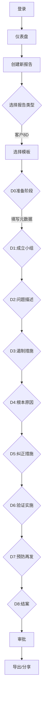
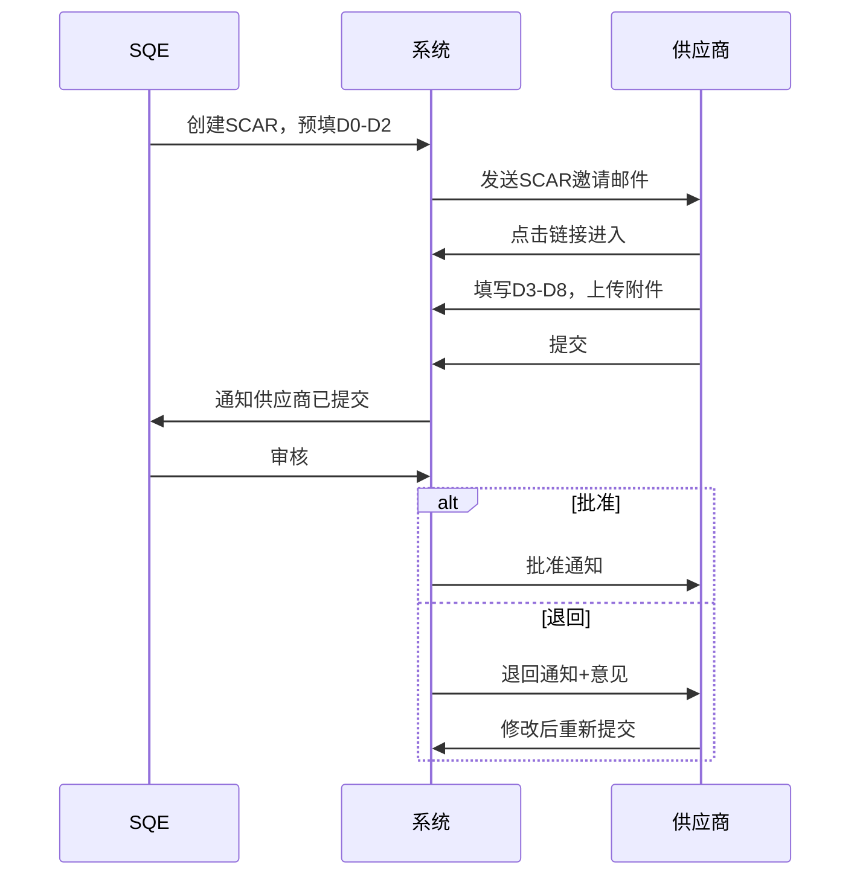
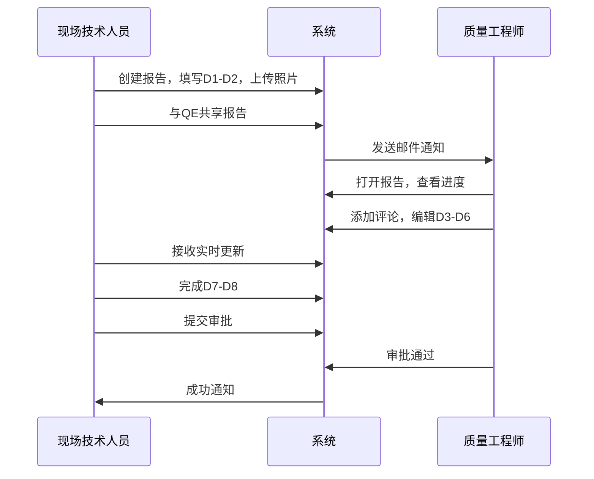
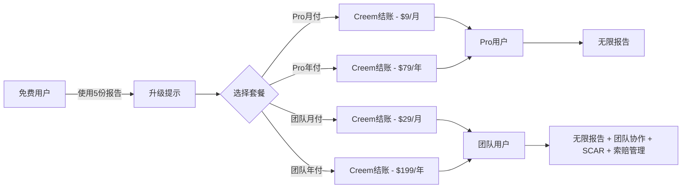
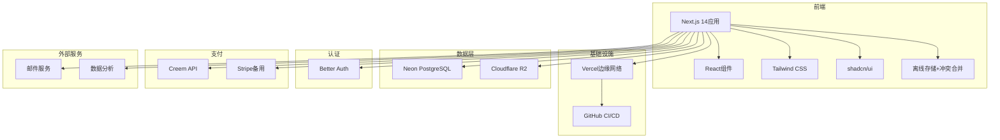

# 8D报告创建工具 - 完整产品需求文档（Phase 2 完整设计）

---

**⚠️ 注意**：本文档包含完整功能设计，仅用于Phase 2开发。Phase 1 MVP请参考 [PRD.md](./PRD.md)。

---

## 1. 产品概述

**8D报告创建工具**是一款面向全球用户的云端解决方案，专为质量工程团队提供8D报告创建、协作编辑和专业导出功能。该Web应用让现场技术人员和质量工程师能够直接在移动设备上记录问题、拍照取证并完成8D报告——彻底告别"现场拍照→回办公室上传照片→手动填写Excel模板"的繁琐流程。

### 1.1 目标市场
- **主要用户**：质量工程师（所有制造业）、汽车行业供应商（AIAG标准支持）、中小微企业质量团队、跨部门问题解决小组
- **次要用户**：现场技术人员、项目经理、供应商（通过SCAR）、客户（通过分享链接）
- **地理区域**：全球市场（英语优先，多语言支持）

### 1.2 产品价值
- **高效**：现场完成8D报告，支持拍照和实时数据录入
- **协作**：多用户实时编辑，自动版本控制，报告分享
- **专业**：符合AIAG标准的模板，支持导出Excel/PDF
- **易用**：通过PWA可在任何设备（手机、平板、电脑）上使用
- **安全**：企业级数据保护，支持行级安全策略
- **行业友好**：汽车行业（完整AIAG标准、PPAP、FMEA、SPC/MSA）、通用行业（简洁通用模板、看板视图、成本跟踪）、供应商管理（在线SCAR填写、催办、响应统计）

### 1.3 技术栈
- **前端**：Next.js 14 App Router + React 18 + Tailwind CSS + shadcn/ui
- **部署**：Vercel（与GitHub集成CI/CD）
- **数据库**：Neon（Serverless PostgreSQL）
- **ORM**：Drizzle ORM
- **认证**：Better Auth（JWT）
- **存储**：Cloudflare R2（兼容S3）
- **支付**：Creem（Stripe备用）
- **离线**：IndexedDB (dexie.js) + Service Worker
- **状态管理**：React Server Components + 客户端zustand
- **富文本**：TipTap
- **图表**：recharts
- **日期处理**：date-fns

---

## 2. 核心功能

### 2.1 用户角色与定价
| 套餐 | 价格 | 报告数量 | 附件限制 | 功能 |
|------|------|---------|---------|------|
| 免费版 | $0 | 5份/月 | 5MB/个，20MB/报告 | 通用8D+AIAG模板、PDF导出、水印 |
| Pro月付 | $9.99/月 | 无限 | 10MB/个，100MB/报告 | 全部模板、PDF导出、SPC图表、看板视图 |
| Pro年付 | $79/年 | 无限 | 10MB/个，100MB/报告 | 同上 |
| 团队月付 | $29.99/月 | 无限 | 25MB/个，500MB/报告 | 全部功能、最多5人协作、SCAR/索赔管理、API访问 |
| 团队年付 | $249.99/年 | 无限 | 25MB/个，500MB/报告 | 同上 |

### 2.2 团队版权限设计
| 权限 | 查看 | 评论 | 编辑 | 管理员 |
|------|:----:|:----:|:----:|:-------:|
| 查看报告内容 | ✅ | ❌ | ❌ | ❌ |
| 添加评论 | ✅ | ✅ | ❌ | ❌ |
| 编辑报告内容 | ✅ | ✅ | ✅ | ❌ |
| 上传/删除附件 | ✅ | ❌ | ✅ | ❌ |
| 管理协作者 | ✅ | ❌ | ❌ | ✅ |
| 删除报告 | ❌ | ❌ | ❌ | ✅ |
| 导出报告 | ✅ | ❌ | ✅ | ✅ |
| 发送SCAR给供应商 | ✅ | ❌ | ✅ | ✅ |
| 发起索赔 | ✅ | ❌ | ✅ | ✅ |
| 审批索赔/报告 | ❌ | ❌ | ❌ | ✅ |

### 2.3 功能模块（完整版）
1. **认证页面**：注册、登录、密码重置、邮箱验证
2. **仪表盘**：报告列表、看板视图、质量成本统计、待办事项
3. **报告创建向导**：类型选择→模板选择→D0→D1→D8
4. **报告查看/编辑**：完整报告展示、内联编辑、评论、历史版本
5. **个人中心与设置**：用户资料、订阅管理、模板构建器、编号配置
6. **SCAR管理**：供应商在线填写、催办、审核、统计
7. **索赔管理**：客户索赔、供应商追偿、内部损失记录
8. **管理后台**：用户管理、数据分析、模板管理

### 2.4 页面详情
| 页面 | 模块 | 功能描述 |
|------|------|----------|
| 落地页 | Hero、功能介绍、定价、CTA | 用于获取用户的营销页面 |
| 认证 | 登录、注册、忘记密码 | 邮箱 + OAuth（Google、GitHub） |
| 仪表盘-经理 | 看板、统计、质量成本、待审批 | 质量经理全局视图 |
| 仪表盘-CQE/PQE | 我的报告、我的任务、待回复评论 | 执行人员视图 |
| 仪表盘-SQE | SCAR看板、供应商统计、逾期提醒 | SQE专属视图 |
| 报告创建向导 | 报告类型→模板→D0-D8分步 | 进度指示器、自动保存、离线编辑 |
| 报告视图 | 展示、编辑、评论、版本对比 | 可折叠章节、附件预览 |
| SCAR供应商端 | 在线填写、附件上传、提交 | 无需注册、token链接访问 |
| 索赔管理 | 列表、创建、审批、统计 | 支持关联报告 |
| 分享链接 | 只读查看、可选密码保护 | 无需注册访问 |
| 个人中心 | 用户信息、订阅、我的模板 | Creem集成用于升级 |
| 设置 | 通知、语言、API密钥、报告编号配置 | 偏好设置管理 |

### 2.5 8D标准步骤（AIAG + 通用行业扩展）
选择模板后，D1-D8的内容根据模板动态渲染：
```
D0: 准备阶段 (Prepare for the 8D Process) - 接收问题通知、评估是否启动8D、紧急响应（如需要）、分配报告编号、录入报告级元数据
D1: 成立小组 - 团队成员、职责分工
D2: 问题描述 - IS/IS NOT（可选，汽车行业模板默认显示）、问题现象、零件追溯、现场照片
D3: 临时遏制措施 - 保护客户的即时行动、有效期、在途/在库/出货统计、验证证据
D4: 根本原因分析 - 5个为什么、鱼骨图、发生/流出/系统原因、验证计划
D5: 永久纠正措施 - 长期解决方案、成本估算、ROI分析
D6: 实施与验证 - 行动计划、验证数据、证据
D7: 防止再发 - 系统性变更、控制计划更新、横向展开、培训
D8: 结案与表彰 - 自动完成核查、经验教训、审批
```

### 2.6 主机厂特定模板库 + 通用行业模板库
#### 2.6.1 内置模板列表
| 模板名称 | 适用场景 | 特点 |
|---------|---------|------|
| **通用8D报告** | 所有行业/内部改善 | 默认选中，简洁无汽车术语 |
| **AIAG 8D报告** | 汽车供应商 | AIAG CQI-20标准 |
| **内部问题8D** | 内部质量问题 | 产线/工位字段，无客户相关 |
| **供应商SCAR** | 向供应商发起8D | 供应商可在线填写 |
| **福特G8D** | Ford客户 | 福特G8D标准 |
| **大众Formel Q** | VW/VAG客户 | Formel Q质量保证协议 |
| **通用BIQS** | GM客户 | GM BIQS |
| **自定义模板** | 任意场景 | 拖拽式表单设计器 |

#### 2.6.2 自定义模板编辑器
- 支持拖拽式表单设计
- 字段验证规则配置
- 导出字段映射配置（Excel导出）
- 模板审批发布流程
- 模板版本管理
- 可设置默认显示/折叠字段

#### 2.6.3 模板权限
- 个人模板：仅创建者可见
- 团队模板：团队成员可见
- 企业模板：全公司可见
- 公共模板：所有用户可用

### 2.7 任务分配与追踪
#### 2.7.1 D步骤任务分配
每个8D步骤都需要单独分配任务：
| 字段 | 类型 | 必填 | 说明 |
|------|------|------|------|
| 负责人 | 用户选择（从D1团队） | ✅ | 从D1团队成员列表选择 |
| 计划截止日期 | 日期 | ✅ | |
| 实际完成日期 | 日期 | ❌ | 完成后填写 |
| 任务状态 | 选项 | ✅ | 未开始/进行中/已完成/逾期 |
| 任务描述 | 文本 | ✅ | 具体要做什么 |
| 验收标准 | 文本 | ❌ | 如何确认完成 |
| 前置依赖 | 多选 | ❌ | 依赖哪些任务先完成 |

#### 2.7.2 任务甘特图视图
- 显示所有D步骤任务的时间线
- 自动计算关键路径
- 任务逾期高亮显示（红色）
- 任务即将到期提前24小时提醒（橙色）
- 拖拽调整任务日期

#### 2.7.3 任务通知与提醒
- 负责人变更时立即通知
- 任务到期前24小时提醒
- 任务逾期自动提醒（每日）
- 评论中@某人自动创建子任务

#### 2.7.4 任务完成验证
- 任务完成需上传证据（照片/文件）
- 需审批人确认才算完成
- 完成记录可追溯

### 2.8 报告审核流程
#### 2.8.1 审核模式选择
**模式1：简易审批（默认，通用行业）**
```
创建报告 → D0-D8草稿 → 内部审批 → 结案
```

**模式2：完整审批（汽车行业/大公司）**
```
创建报告 → D0-D8草稿 → 内部1级审核 → 内部2级审核 → 提交给客户 → 客户反馈 → 修改（如需要）→ 客户批准 → 结案
```

**模式3：SCAR供应商审批**
```
创建SCAR → D0-D2预填 → 发送给供应商 → 供应商填写D3-D8 → 内部审核 → 批准/退回 → 结案
```

#### 2.8.2 各阶段功能（完整审批模式）
| 阶段 | 可编辑 | 可评论 | 状态标识 | 通知对象 |
|------|--------|--------|---------|---------|
| 草稿 | ✅ 所有成员 | ✅ | 🔵 草稿 | 无 |
| 1级审核 | ❌ 只有审核人可编辑 | ✅ | 🟡 审核中 | 1级审核人 |
| 2级审核 | ❌ 只有审核人可编辑 | ✅ | 🟡 审核中 | 2级审核人 |
| 客户提交 | ❌ | ✅ | 🟣 客户审核中 | 客户 |
| 客户反馈 | ✅ 可修改 | ✅ | 🟠 需要修改 | 所有人 |
| 客户批准 | ❌ | ✅ | 🟢 批准 | 所有人 |
| 结案 | ❌ | ✅ | 🟢 结案 | 所有人 |

#### 2.8.3 审核记录
- 每个审核阶段的审核人、时间、意见
- 审核历史完整可追溯
- 支持审核意见导出

### 2.9 问题升级机制
#### 2.9.1 升级触发条件
| 升级事件 | 升级阈值 | 升级级别 |
|---------|---------|---------|
| D3遏制措施未填写 | 问题创建后3天 | 2级（部门主管） |
| D4根本原因未确认 | D3完成后7天 | 2级（部门主管） |
| 整个8D未完成 | 问题创建后30天 | 3级（质量总监） |
| SCAR供应商未回复 | SCAR发送后7天 | 2级（SQE主管） |
| 特采即将到期 | 到期前7天 | 1级（负责人） |
| 特采已过期 | 到期日当天 | 2级（部门主管） |

#### 2.9.2 升级通知方式
- 邮件通知（必选）
- 站内消息
- 短信（高级功能）
- 企业微信/钉钉集成（需配置）

#### 2.9.3 升级记录
- 每次升级完整记录
- 升级后的处理记录
- 可导出升级历史报表

### 2.10 SPC控制图详细设计
#### 2.10.1 支持的控制图类型
| 图类型 | 数据类型 | 控制限计算 |
|-------|---------|-----------|
| Xbar-R | 连续变量，小样本 | 均值±3σ |
| Xbar-S | 连续变量，大样本 | 均值±3σ |
| I-MR | 单个读数 | 移动极差 |
| P图 | 不合格率 | 二项分布 |
| C图 | 不合格数 | 泊松分布 |
| U图 | 单位不合格数 | 泊松分布 |

#### 2.10.2 交互要求
- ✅ 鼠标悬停显示具体数值
- ✅ 点击数据点显示详情
- ✅ 缩放（滚轮缩放）
- ✅ 平移（拖拽图表）
- ✅ 异常点高亮显示（红色）
- ✅ 异常规则识别：
  - 1点超出3σ
  - 连续9点在中心线一侧
  - 连续6点上升/下降
  - 连续14点交替上下
  - 2/3连续点在2-3σ之间
  - 4/5连续点在1-2σ之间
  - 连续15点在1σ内
  - 连续8点在两侧1σ外

#### 2.10.3 Cpk计算
输入字段：
- 规格上限USL
- 规格下限LSL
- 目标值Target
- 过程标准差σ（自动从数据计算）

自动计算显示：
- Cp = (USL-LSL)/6σ
- Cpk = min( (USL-μ)/3σ, (μ-LSL)/3σ )
- Ppk（长期能力）
- 过程能力评价（颜色编码：<1.33红色/1.33-1.67黄色/1.67-2.0绿色/2.0+深蓝色）

#### 2.10.4 性能说明
- SPC计算在**后端**进行
- 前端仅渲染生成的图表
- 避免低配设备（如Chromebook）卡顿

### 2.11 邮件集成详细设计
#### 2.11.1 邮件发送事件
| 事件 | 收件人 | 模板 | 延迟发送 |
|------|-------|------|---------|
| 报告创建通知 | 团队成员 | 创建通知 | 立即 |
| 任务分配 | 负责人 | 任务分配 | 立即 |
| 任务提醒 | 负责人 | 提醒通知 | 到期前24h |
| 任务逾期 | 负责人+主管 | 逾期警告 | 立即+每日重复 |
| 审核请求 | 审核人 | 审核通知 | 立即 |
| SCAR发送 | 供应商联系人 | SCAR通知 | 立即 |
| SCAR催办 | 供应商联系人 | 催办通知 | 逾期后 |
| 客户反馈 | 创建人 | 反馈通知 | 立即 |
| 报告批准 | 团队 | 批准通知 | 立即 |
| 升级通知 | 被升级人 | 升级通知 | 立即 |

#### 2.11.2 邮件回复同步
技术要求：
- 使用入站邮箱地址（例如：8d-{report_id}@yourdomain.com）
- 回复邮件自动解析并添加为评论
- 邮件中的附件自动上传为报告附件
- 邮件完整内容（包括引用历史）归档
- 已读状态双向同步

#### 2.11.3 邮件模板自定义
- 支持HTML邮件模板编辑
- 变量替换：{报告编号}、{问题描述}、{负责人}等
- 多语言模板支持
- 品牌Logo自定义
- 发件人名称自定义

### 2.12 文件上传与附件管理
#### 2.12.1 支持的文件类型
| 类型 | 格式 | 说明 |
|------|------|------|
| **照片** | JPG, PNG, HEIC, WebP | 用于现场取证、问题记录 |
| **文档** | PDF, DOC, DOCX | 用于规范、报告、证书 |
| **表格** | XLS, XLSX, CSV | 用于数据记录、SPC数据 |
| **图片** | SVG, BMP, TIFF | 用于图表、示意图 |
| **压缩包** | ZIP | 用于批量文件交付 |

#### 2.12.2 文件大小限制
| 套餐 | 单文件限制 | 单报告总限制 |
|------|-----------|------------|
| 免费版 | 5MB | 20MB |
| Pro版 | 10MB | 100MB |
| 团队版 | 25MB | 500MB |

#### 2.12.3 存储方案
- **存储服务**：Cloudflare R2（兼容S3 API）
- **CDN加速**：全球边缘节点，图片自动优化
- **访问控制**：预签名URL，限时访问
- **数据安全**：传输加密（TLS）、存储加密

#### 2.12.4 报告导出格式
**Excel导出（主要格式）**：
```
📁 报告名称_YYYYMMDD.zip
├── 📄 8D_Report.xlsx              # 主报告文件
├── 📁 attachments/                 # 附件文件夹
│   ├── 📁 d2_photos/            # D2问题照片
│   ├── 📁 d3_photos/            # D3遏制措施照片
│   ├── 📁 d4_evidence/          # D4根本原因证据
│   │   ├── fmea_analysis.pdf
│   │   └── test_results.xlsx
│   ├── 📁 d5_documents/         # D5纠正措施文档
│   ├── 📁 d6_validation/        # D6验证照片和文档
│   └── 📁 d7_documents/         # D7预防措施文档
└── 📄 metadata.json             # 元数据
```

**Excel报告工作表结构**：
| 工作表 | 内容 |
|--------|------|
| **封面** | 报告标题、编号、日期、团队信息、客户编号 |
| **问题概览** | IS/IS NOT汇总、零件信息、追溯信息（汽车模板） |
| **D0准备** | 报告元数据、问题来源、紧急响应 |
| **D1团队** | 团队成员、角色与职责 |
| **D2问题** | 完整问题描述、照片（嵌入或链接） |
| **D3遏制** | 临时措施、有效期、验证方式、库存统计 |
| **D4根因** | 5-Why分析、鱼骨图分类、验证结果 |
| **D5纠正** | 方案对比、选择理由、成本估算 |
| **D6验证** | 实施计划、验证数据、验证证据 |
| **D7预防** | 系统变更、横向展开、控制计划更新 |
| **D8结案** | 自动完成检查、经验教训、审批 |
| **时间线** | 各D阶段完成时间节点 |
| **附件清单** | 所有附件的链接和说明 |
| **签名页** | 审批人签名区（可打印） |

**PDF导出（可选格式）**：
- 完整报告（附件以链接形式提供）
- 精简版本（仅关键内容和证据摘要）

**导出文件命名规则**：
```
{报告编号}_{YYYYMMDD}_{版本号}.{格式}
例如：QR-2024-0035_20240615_v1.xlsx
```

---

## 2.13 报告类型与转换
### 2.13.1 报告类型
创建报告时必须选择类型：
| 类型 | 说明 | 适用模板 |
|------|------|---------|
| 客户8D | 发给客户的正式报告 | 通用8D / AIAG / 福特G8D等主机厂模板 |
| 内部8D | 内部问题改善，无需发给客户 | 内部8D模板 |
| 供应商SCAR | 发给供应商的纠正措施要求 | 供应商SCAR模板 |

### 2.13.2 报告类型转换
**支持一键转换**（数据保留）：
- 内部8D → 客户8D
- 内部8D → 供应商SCAR
- 客户8D → 内部8D（部分隐藏字段保留但不显示）

**转换时提示**：
- "以下字段在新报告类型中不适用，将隐藏但保留数据"
- 确认后执行转换

---

## 2.14 索赔管理
### 2.14.1 索赔类型
| 类型 | 说明 |
|------|------|
| 客户索赔 | 客户向我们索赔 |
| 供应商追偿 | 我们向供应商索赔（charge back） |
| 内部损失 | 内部报废/返工/停产损失 |

### 2.14.2 索赔字段
| 字段 | 类型 | 必填 | 说明 |
|------|------|------|------|
| 索赔方向 | 选择 | ✅ | 客户索赔/供应商追偿/内部损失 |
| 金额 | 数字 | ✅ | |
| 货币 | 选择 | ✅ | 默认USD |
| 关联报告 | 选择 | ❌ | 关联的8D报告（可选但推荐） |
| 索赔方 | 文本 | ✅ | 客户/供应商名称 |
| 索赔说明 | 文本 | ✅ | |
| 证据文件 | 附件 | ❌ | 发票、邮件等 |
| 状态 | 选择 | ✅ | 待确认/已确认/已支付/有争议/已取消 |
| 负责人 | 用户 | ✅ | |
| 到期日 | 日期 | ✅ | |

### 2.14.3 索赔审批流程
```
创建索赔 → 内部审核确认 → 跟进处理 → 结案
```

### 2.14.4 质量成本统计
- 仪表盘显示：
  - 本月质量成本总额
  - 客户索赔额
  - 供应商追偿额
  - 内部损失额
- 趋势图（过去3/6/12个月）
- 按产品/供应商分类统计

---

## 2.15 SCAR（供应商纠正措施请求）管理
### 2.15.1 SCAR创建
- 选择供应商（从供应商列表）
- 选择模板（供应商SCAR模板）
- 预填D0-D2信息
- 设置供应商填写截止日期
- 一键发送邀请邮件

### 2.15.2 供应商在线填写
- 供应商收到邮件，点击链接（无需注册）
- 访问带token的页面，有访问时效性
- 填写D3-D8内容
- 上传附件
- 提交给我们

### 2.15.3 SQE操作
- 查看SCAR进度看板
- 一键催办（记录催办时间）
- 供应商提交后审核
- 批准或退回（附意见）
- 查看供应商响应统计

### 2.15.4 供应商统计
- 按供应商查看SCAR数量
- 平均响应时间
- 逾期率
- 一次性通过率

---

## 2.16 报告分享链接
### 2.16.1 分享方式
| 方式 | 说明 |
|------|------|
| 公开分享链接 | 任何人可访问（可选密码） |
| 内部成员分享 | 需要登录并有权限 |
| 客户/供应商分享 | 无需注册，链接带token |

### 2.16.2 链接配置
- 可设置有效期（7天/30天/永久）
- 可选密码保护
- 可选择是否允许下载附件
- 可选择是否允许评论

---

## 2.17 改善成本与ROI
### 2.17.1 D5-D6新增字段
| 字段 | 说明 |
|------|------|
| 纠正措施成本 | 人工+物料+设备投入金额 |
| 质量问题损失 | 估算的年损失金额（问题发生前） |
| ROI预期 | 预期投资回报率（月/季度/年） |
| 验证后的ROI | D6填写实际改善后的ROI |

---

## 2.18 报告编号配置
### 2.18.1 编号格式自定义
支持变量：
- `{YYYY}` → 4位年份
- `{YY}` → 2位年份
- `{MM}` → 月份
- `{DD}` → 日期
- `{SEQ}` → 流水号（可设起始值、位数）
- `{TYPE}` → 报告类型缩写（C=客户/I=内部/S=SCAR）

**示例配置**：
- QR-{YYYY}-{SEQ} → QR-2024-0001
- {TYPE}-{YY}{MM}-{SEQ} → C-2406-0001

### 2.18.2 起始配置
- 可设置流水号起始值
- 可设置流水号位数（3/4/5/6位）

---

## 3. 用户流程
### 3.1 主要流程：创建客户8D


### 3.2 SCAR供应商流程


### 3.3 协作流程


### 3.4 订阅流程


---

## 4. UI设计
### 4.1 设计系统
**配色方案**：
```
主色:        #165DFF (蓝色 - 信任、专业)
辅助色:      #36D399 (绿色 - 成功、成长)
强调色:      #FF6B35 (橙色 - 行动、注意)
背景色:      #FFFFFF (浅色) / #0F172A (深色)
表面色:      #F8FAFC (浅色) / #1E293B (深色)
主要文字:    #1E293B (浅色) / #F8FAFC (深色)
次要文字:    #64748B
边框色:      #E2E8F0 (浅色) / #334155 (深色)
```

**字体排版**：
```
字体族: Inter (主字体), system-ui (备选)
标题:   600-700 字重
正文:   400-500 字重
字号:   12/14/16/18/20/24/30/36/48px
```

**组件** (shadcn/ui)：
- 按钮：圆角 (rounded-lg)，微妙阴影
- 卡片：白色/表面色，柔和边框，悬停提升效果
- 表单：简洁输入框，清晰标签，内联验证
- 导航：粘性顶部栏，移动端抽屉菜单

### 4.2 响应式设计
**断点**：
```
移动端:  < 640px   (单列布局，触摸优化)
平板:    640-1024px (自适应网格，滑动手势)
桌面端:  > 1024px   (多列布局，键盘快捷键)
```

**移动端优先特性**：
- 相机访问用于即时拍照
- 滑动手势切换步骤
- 大触摸目标（最小44px）
- 离线自动保存，联网后同步（含冲突处理）
- 底部导航栏

### 4.3 PWA功能
- 添加到主屏幕提示
- 使用IndexedDB (dexie.js) 缓存的离线模式
- 连接恢复时后台同步（冲突检测与合并）
- 协作更新的推送通知
- 类似App的启动画面和图标

### 4.4 UI交互规范与按钮位置
#### 报告创建向导流程（修复顺序问题）
| 步骤 | 内容 | 按钮位置 | 说明 |
|------|------|----------|------|
| 1 | **选择报告类型** | 居中卡片选择 | 必须在模板之前！类型：客户8D/内部8D/供应商SCAR |
| 2 | **选择模板** | 同上 | 根据类型自动筛选可用模板 |
| 3 | **D0准备阶段** | 分步表单 | 报告编号生成、元数据填写 |
| 4-11 | **D1-D8** | 左侧导航 + 顶部进度条 | 点击导航切换，自动保存 |

#### 报告编辑页UI布局
| 区域 | 内容 | 说明 |
|------|------|------|
| **顶部栏** | 报告标题、编号、状态、右侧操作按钮 | 操作按钮：保存、导出、分享、提交审批、更多（复制/删除/转换类型） |
| **左侧导航** | D0-D8步骤列表 + 进度指示器 | 当前步骤高亮，完成步骤打勾 |
| **主内容区** | 当前步骤表单 + 附件上传 + 评论 | 表单支持富文本，照片支持相机直接拍 |
| **右侧边栏（≥1024px）** | 团队成员、任务列表、活动日志 | 可折叠 |
| **底部栏（移动端）** | 保存、下一步、上一步 | 固定在底部 |

#### 按钮优先级与位置
- **主要操作**：右上角或底部，蓝色主色，最小44x44px（移动端）
  - 保存、提交审批、下一步
- **次要操作**：灰色，在主要操作旁边
  - 上一步、预览
- **三级操作**：更多菜单（⋮）
  - 复制报告、转换类型、删除

#### 字段必填性策略
| 模式 | 默认必填字段 | 说明 |
|------|-------------|------|
| **通用行业/小公司** | 极少：问题描述、临时措施、根本原因 | 其他可选，降低使用门槛 |
| **汽车行业** | 几乎所有字段必填 | 符合AIAG要求 |
| **内部8D** | 问题描述、遏制措施、根本原因、纠正措施 | 无客户相关字段 |

### 4.5 离线同步与冲突处理
#### 离线存储方案
- 使用 **dexie.js** 管理IndexedDB
- 缓存：报告草稿、模板、用户设置、最近100个通知
- 自动保存间隔：10秒，或离开页面前

#### 冲突处理策略（简化版CRDT）
1. **检测**：本地最后修改时间 vs 服务器最后修改时间
2. **自动合并**：
   - 文本字段：保留两者，用 `<<<<<<< LOCAL / ======= / >>>>>>> REMOTE` 标记
   - 附件：两者都保留
   - 状态：服务器版本优先
3. **用户确认**：显示冲突列表，用户选择保留哪个

#### 后台同步
- 网络恢复后自动同步（指数退避重试）
- 同步状态指示器：右上角小图标（🔄/✅/⚠️）

---

## 5. 技术架构
### 5.1 系统架构


### 5.2 技术选型（完整）
见第1.3节

### 5.3 路由结构
```
/ → 落地页（营销）
/login → 登录
/signup → 注册
/dashboard → 仪表盘（自动跳转角色视图）
/dashboard/manager → 质量经理仪表盘
/dashboard/cqe → CQE/PQE仪表盘
/dashboard/sqe → SQE仪表盘
/reports → 报告列表（看板/列表切换）
/reports/new → 创建报告向导（类型→模板→D0→D8）
/reports/:id → 查看/编辑报告
/reports/:id/convert → 报告类型转换
/scars → SCAR列表
/scars/new → 新建SCAR
/scars/:id → SCAR详情（供应商端单独页面）
/claims → 索赔列表
/claims/new → 新建索赔
/profile → 用户资料
/settings → 应用设置
/settings/report-number → 报告编号配置
/pricing → 订阅套餐
/blog → 内容营销
/share/:token → 报告分享链接（无需登录）
/supplier/:token → SCAR供应商填写页面（无需登录）
```

### 5.4 API设计（完整）
```
# 认证（通过Better Auth）
POST /api/auth/signup
POST /api/auth/login
POST /api/auth/logout
POST /api/auth/reset-password

# 报告
GET    /api/reports → 列出用户报告
POST   /api/reports → 创建报告
GET    /api/reports/:id → 获取报告
PUT    /api/reports/:id → 更新报告
DELETE /api/reports/:id → 删除报告
POST   /api/reports/:id/share → 分享给用户
POST   /api/reports/:id/submit → 提交报告到下一审核阶段
POST   /api/reports/:id/convert → 转换报告类型
GET    /api/reports/:id/share-link → 生成分享链接

# 模板
GET    /api/templates → 列出模板
POST   /api/templates → 创建自定义模板
PUT    /api/templates/:id → 更新模板
DELETE /api/templates/:id → 删除模板

# 附件
POST   /api/attachments/upload → 上传附件
DELETE /api/attachments/:id → 删除附件

# 评论
GET    /api/reports/:id/comments → 列出评论
POST   /api/reports/:id/comments → 添加评论

# 任务
GET    /api/reports/:id/tasks → 获取报告任务
POST   /api/reports/:id/tasks → 创建任务
PUT    /api/tasks/:id → 更新任务
DELETE /api/tasks/:id → 删除任务
POST   /api/tasks/:id/complete → 完成任务

# 审核记录
GET    /api/reports/:id/reviews → 获取审核记录
POST   /api/reviews/:id/approve → 批准
POST   /api/reviews/:id/reject → 拒绝

# 升级
GET    /api/escalations → 获取所有升级
POST   /api/escalations/:id/resolve → 解决升级

# FMEA关联
GET    /api/reports/:id/fmea-links → 获取FMEA关联
POST   /api/reports/:id/fmea-links → 添加FMEA关联
PUT    /api/fmea-links/:id → 更新FMEA关联
DELETE /api/fmea-links/:id → 删除FMEA关联

# SPC
POST   /api/reports/:id/spc/analyze → 后端分析SPC数据，返回图表
GET    /api/reports/:id/spc-chart → 获取SPC图表缓存

# SCAR
GET    /api/scars → 列出SCAR
POST   /api/scars → 创建SCAR
GET    /api/scars/:id → 获取SCAR
POST   /api/scars/:id/send → 发送给供应商
POST   /api/scars/:id/remind → 催办
POST   /api/scars/:id/approve → 批准SCAR
POST   /api/scars/:id/reject → 退回SCAR
GET    /api/scars/:token/supplier → 供应商端获取SCAR数据（无需登录）
PUT    /api/scars/:token/supplier → 供应商端提交SCAR

# 索赔
GET    /api/claims → 列出索赔
POST   /api/claims → 创建索赔
GET    /api/claims/:id → 获取索赔
PUT    /api/claims/:id → 更新索赔
POST   /api/claims/:id/confirm → 确认索赔
POST   /api/claims/:id/resolve → 结案索赔
GET    /api/claims/stats → 获取质量成本统计

# 订阅（通过Creem）
GET    /api/subscription → 获取当前订阅
POST   /api/subscription/create → 创建结账会话
POST   /api/webhooks/creem → 处理Creem webhook

# 导出
POST   /api/reports/:id/export → 生成Excel/PDF
```

---

## 6. 数据模型（完整）
### 6.1 ER图
```mermaid
erDiagram
    USERS ||--o{ REPORTS : creates
    USERS ||--o{ COMMENTS : writes
    USERS ||--o{ SUBSCRIPTIONS : has
    USERS ||--o{ CLAIMS : manages
    REPORTS ||--o{ COMMENTS : has
    REPORTS ||--o{ REPORT_VERSIONS : has
    REPORTS ||--o{ ATTACHMENTS : has
    REPORTS ||--o{ REPORT_SHARES : has
    REPORTS ||--o{ REPORT_TASKS : has
    REPORTS ||--o{ REPORT_REVIEW_LOGS : has
    REPORTS ||--o{ ESCALATION_LOGS : has
    REPORTS ||--o{ REPORT_FMEA_LINKS : has
    REPORTS ||--o{ CLAIMS : related_to
    REPORTS ||--o{ SCARS : related_to
    TEMPLATES ||--o{ REPORTS : uses
    SUBSCRIPTIONS ||--o| PLANS : subscribes_to
    REPORT_TASKS ||--o{ TASK_DEPENDENCIES : has

    USERS {
        uuid id PK
        string email
        string name
        string avatar_url
        string auth_provider
        timestamp email_verified_at
        timestamp created_at
    }

    SUBSCRIPTIONS {
        uuid id PK
        uuid user_id FK
        string plan_id
        string creem_subscription_id
        string status
        timestamp current_period_start
        timestamp current_period_end
        boolean cancel_at_period_end
        timestamp created_at
    }

    PLANS {
        uuid id PK
        string creem_product_id
        string name
        decimal price_monthly
        decimal price_yearly
        int reports_per_month
        int max_team_members
        boolean is_active
    }

    REPORTS {
        uuid id PK
        uuid user_id FK
        uuid template_id FK
        string title
        string status
        string report_type FK
        string priority
        string source
        string supplier_name
        jsonb data
        jsonb step_status
        jsonb metadata
        int report_number serial
        timestamp created_at
        timestamp updated_at
    }

    TEMPLATES {
        uuid id PK
        uuid creator_id FK
        string name
        string description
        string type
        string category
        jsonb structure
        jsonb settings
        boolean is_default
        boolean is_public
        int usage_count
        timestamp created_at
        timestamp updated_at
    }

    ATTACHMENTS {
        uuid id PK
        uuid report_id FK
        string step_id
        string storage_path
        string url
        string filename
        string file_type
        string mime_type
        int file_size
        int sort_order
        timestamp created_at
    }

    COMMENTS {
        uuid id PK
        uuid report_id FK
        uuid user_id FK
        string content
        uuid parent_id
        boolean is_resolved
        timestamp created_at
        timestamp updated_at
    }

    REPORT_VERSIONS {
        uuid id PK
        uuid report_id FK
        uuid user_id FK
        jsonb data
        int version_number
        string change_summary
        timestamp created_at
    }

    REPORT_SHARES {
        uuid id PK
        uuid report_id FK
        uuid shared_by FK
        string shared_with_email
        uuid shared_with_user_id FK
        string permission_level
        string access_token
        timestamp expires_at
        timestamp created_at
    }

    REPORT_TASKS {
        uuid id PK
        uuid report_id FK
        string step_id
        string title
        string description
        uuid assignee_id FK
        timestamp due_date
        timestamp actual_completion_date
        string status
        string acceptance_criteria
        timestamp created_at
        timestamp updated_at
    }

    TASK_DEPENDENCIES {
        uuid id PK
        uuid task_id FK
        uuid depends_on_task_id FK
    }

    REPORT_REVIEW_LOGS {
        uuid id PK
        uuid report_id FK
        string stage
        uuid reviewer_id FK
        string comment
        string status
        timestamp created_at
    }

    ESCALATION_LOGS {
        uuid id PK
        uuid report_id FK
        string escalation_type
        int escalation_level
        uuid escalated_to_id FK
        timestamp resolved_at
        timestamp created_at
    }

    REPORT_FMEA_LINKS {
        uuid id PK
        uuid report_id FK
        string fmea_number
        int fmea_rpn_before
        int fmea_rpn_after
        timestamp created_at
    }

    SCARS {
        uuid id PK
        uuid report_id FK
        string supplier_name
        string supplier_contact_email
        string supplier_access_token
        timestamp supplier_access_expires_at
        timestamp supplier_submitted_at
        timestamp due_date
        int reminder_count
        timestamp last_reminder_at
        string status
        timestamp created_at
        timestamp updated_at
    }

    CLAIMS {
        uuid id PK
        uuid report_id FK
        string direction
        decimal amount
        string currency
        string description
        string claimant
        jsonb evidence_files
        string status
        uuid claimed_by FK
        timestamp confirmed_at
        timestamp resolved_at
        timestamp created_at
        timestamp updated_at
    }
```

### 6.2 数据库Schema（PostgreSQL DDL完整）
```sql
-- 启用UUID扩展
create extension if not exists "uuid-ossp";

-- ====================
-- 核心用户与认证表
-- ====================

-- 用户表
create table public.users (
    id uuid primary key default uuid_generate_v4(),
    email text unique not null,
    name text,
    avatar_url text,
    auth_provider text default 'email',
    timezone text default 'UTC',
    locale text default 'zh-CN',
    email_verified_at timestamp with time zone,
    created_at timestamp with time zone default timezone('utc'::text, now()) not null,
    updated_at timestamp with time zone default timezone('utc'::text, now()) not null
);

-- 用户设置表
create table public.user_settings (
    id uuid primary key default uuid_generate_v4(),
    user_id uuid references public.users(id) on delete cascade not null unique,
    report_number_format text default 'QR-{YYYY}-{SEQ:04d}',
    report_number_seq_start integer default 1,
    default_template_id uuid references public.templates(id),
    default_report_type text default 'customer_8d',
    email_notifications boolean default true,
    push_notifications boolean default true,
    compact_mode boolean default false,
    created_at timestamp with time zone default timezone('utc'::text, now()) not null,
    updated_at timestamp with time zone default timezone('utc'::text, now()) not null
);

-- 通知表
create table public.notifications (
    id uuid primary key default uuid_generate_v4(),
    user_id uuid references public.users(id) on delete cascade not null,
    type text not null,
    title text not null,
    content text,
    related_report_id uuid references public.reports(id) on delete set null,
    related_scar_id uuid references public.scars(id) on delete set null,
    related_claim_id uuid references public.claims(id) on delete set null,
    read_at timestamp with time zone,
    created_at timestamp with time zone default timezone('utc'::text, now()) not null
);

-- 供应商表
create table public.suppliers (
    id uuid primary key default uuid_generate_v4(),
    user_id uuid references public.users(id) on delete cascade not null,
    name text not null,
    code text,
    contact_name text,
    contact_email text,
    contact_phone text,
    address text,
    notes text,
    is_active boolean default true,
    created_at timestamp with time zone default timezone('utc'::text, now()) not null,
    updated_at timestamp with time zone default timezone('utc'::text, now()) not null
);

-- 套餐表
create table public.plans (
    id uuid primary key default uuid_generate_v4(),
    creem_product_id text unique not null,
    name text not null,
    description text,
    price_monthly numeric(10,2),
    price_yearly numeric(10,2),
    reports_per_month int default -1,
    max_team_members int default 1,
    max_photos_per_report int default 50,
    features jsonb default '[]',
    is_active boolean default true,
    created_at timestamp with time zone default timezone('utc'::text, now()) not null
);

-- 订阅表
create table public.subscriptions (
    id uuid primary key default uuid_generate_v4(),
    user_id uuid references public.users(id) on delete cascade not null,
    plan_id uuid references public.plans(id),
    creem_subscription_id text unique,
    creem_customer_id text,
    status text not null default 'trialing',
    current_period_start timestamp with time zone,
    current_period_end timestamp with time zone,
    cancel_at_period_end boolean default false,
    reports_used_this_period int default 0,
    created_at timestamp with time zone default timezone('utc'::text, now()) not null,
    updated_at timestamp with time zone default timezone('utc'::text, now()) not null
);

-- 模板表
create table public.templates (
    id uuid primary key default uuid_generate_v4(),
    creator_id uuid references public.users(id),
    name text not null,
    description text,
    type text not null,
    category text,
    structure jsonb not null,
    settings jsonb default '{}',
    is_default boolean default false,
    is_public boolean default false,
    is_ai_generated boolean default false,
    usage_count int default 0,
    created_at timestamp with time zone default timezone('utc'::text, now()) not null,
    updated_at timestamp with time zone default timezone('utc'::text, now()) not null
);

-- 报告表
create table public.reports (
    id uuid primary key default uuid_generate_v4(),
    user_id uuid references public.users(id) on delete cascade not null,
    template_id uuid references public.templates(id),
    title text not null,
    status text not null default 'draft',
    report_type text not null default 'customer_8d',
    priority text not null default 'medium',
    source text,
    supplier_name text,
    data jsonb not null default '{}',
    step_status jsonb default '{}',
    metadata jsonb default '{}',
    report_number serial,
    created_at timestamp with time zone default timezone('utc'::text, now()) not null,
    updated_at timestamp with time zone default timezone('utc'::text, now()) not null
);

-- 附件表
create table public.attachments (
    id uuid primary key default uuid_generate_v4(),
    report_id uuid references public.reports(id) on delete cascade not null,
    step_id text,
    storage_path text not null,
    url text not null,
    filename text not null,
    file_type text not null,
    mime_type text,
    file_size int,
    sort_order int default 0,
    created_at timestamp with time zone default timezone('utc'::text, now()) not null
);

-- 评论表
create table public.comments (
    id uuid primary key default uuid_generate_v4(),
    report_id uuid references public.reports(id) on delete cascade not null,
    user_id uuid references public.users(id) on delete cascade not null,
    content text not null,
    parent_id uuid references public.comments(id) on delete set null,
    is_resolved boolean default false,
    created_at timestamp with time zone default timezone('utc'::text, now()) not null,
    updated_at timestamp with time zone default timezone('utc'::text, now()) not null
);

-- 报告版本表
create table public.report_versions (
    id uuid primary key default uuid_generate_v4(),
    report_id uuid references public.reports(id) on delete cascade not null,
    user_id uuid references public.users(id),
    data jsonb not null,
    version_number int not null,
    change_summary text,
    created_at timestamp with time zone default timezone('utc'::text, now()) not null
);

-- 报告分享表
create table public.report_shares (
    id uuid primary key default uuid_generate_v4(),
    report_id uuid references public.reports(id) on delete cascade not null,
    shared_by uuid references public.users(id),
    shared_with_email text,
    shared_with_user_id uuid references public.users(id),
    permission_level text not null default 'view',
    access_token text unique,
    expires_at timestamp with time zone,
    created_at timestamp with time zone default timezone('utc'::text, now()) not null
);

-- 任务表
create table public.report_tasks (
    id uuid primary key default uuid_generate_v4(),
    report_id uuid references public.reports(id) on delete cascade not null,
    step_id text not null,
    title text not null,
    description text,
    assignee_id uuid references public.users(id) not null,
    due_date timestamp with time zone not null,
    actual_completion_date timestamp with time zone,
    status text not null default 'not_started',
    acceptance_criteria text,
    created_at timestamp with time zone default timezone('utc'::text, now()) not null,
    updated_at timestamp with time zone default timezone('utc'::text, now()) not null
);

-- 任务依赖表
create table public.task_dependencies (
    id uuid primary key default uuid_generate_v4(),
    task_id uuid references public.report_tasks(id) on delete cascade not null,
    depends_on_task_id uuid references public.report_tasks(id) on delete cascade not null
);

-- 审核记录表
create table public.report_review_logs (
    id uuid primary key default uuid_generate_v4(),
    report_id uuid references public.reports(id) on delete cascade not null,
    stage text not null,
    reviewer_id uuid references public.users(id) not null,
    comment text,
    status text not null,
    created_at timestamp with time zone default timezone('utc'::text, now()) not null
);

-- 升级记录表
create table public.escalation_logs (
    id uuid primary key default uuid_generate_v4(),
    report_id uuid references public.reports(id) on delete cascade not null,
    escalation_type text not null,
    escalation_level integer not null,
    escalated_to_id uuid references public.users(id) not null,
    resolved_at timestamp with time zone,
    created_at timestamp with time zone default timezone('utc'::text, now()) not null
);

-- FMEA关联表
create table public.report_fmea_links (
    id uuid primary key default uuid_generate_v4(),
    report_id uuid references public.reports(id) on delete cascade not null,
    fmea_number text not null,
    fmea_rpn_before integer,
    fmea_rpn_after integer,
    created_at timestamp with time zone default timezone('utc'::text, now()) not null
);

-- SCAR表
create table public.scars (
    id uuid primary key default uuid_generate_v4(),
    report_id uuid references public.reports(id) on delete set null,
    supplier_id uuid references public.suppliers(id) on delete set null,
    supplier_name text not null,
    supplier_contact_email text not null,
    supplier_access_token text unique,
    supplier_access_expires_at timestamp with time zone,
    supplier_submitted_at timestamp with time zone,
    due_date timestamp with time zone not null,
    reminder_count int default 0,
    last_reminder_at timestamp with time zone,
    status text not null default 'pending',
    created_at timestamp with time zone default timezone('utc'::text, now()) not null,
    updated_at timestamp with time zone default timezone('utc'::text, now()) not null
);

-- 索赔表
create table public.claims (
    id uuid primary key default uuid_generate_v4(),
    report_id uuid references public.reports(id) on delete set null,
    direction text not null,
    amount numeric(10,2) not null,
    currency text default 'USD',
    description text,
    claimant text not null,
    evidence_files jsonb default '[]',
    status text not null default 'pending',
    claimed_by uuid references public.users(id),
    confirmed_at timestamp with time zone,
    resolved_at timestamp with time zone,
    created_at timestamp with time zone default timezone('utc'::text, now()) not null,
    updated_at timestamp with time zone default timezone('utc'::text, now()) not null
);

-- 索引
create index idx_reports_user_id on public.reports(user_id);
create index idx_reports_template_id on public.reports(template_id);
create index idx_reports_status on public.reports(status);
create index idx_reports_report_type on public.reports(report_type);
create index idx_reports_priority on public.reports(priority);
create index idx_reports_created_at on public.reports(created_at desc);
create index idx_attachments_report_id on public.attachments(report_id);
create index idx_attachments_step_id on public.attachments(step_id);
create index idx_comments_report_id on public.comments(report_id);
create index idx_comments_user_id on public.comments(user_id);
create index idx_subscriptions_user_id on public.subscriptions(user_id);
create index idx_report_versions_report_id on public.report_versions(report_id);
create index idx_report_tasks_report_id on public.report_tasks(report_id);
create index idx_report_tasks_assignee_id on public.report_tasks(assignee_id);
create index idx_report_tasks_due_date on public.report_tasks(due_date);
create index idx_report_review_logs_report_id on public.report_review_logs(report_id);
create index idx_report_review_logs_reviewer_id on public.report_review_logs(reviewer_id);
create index idx_escalation_logs_report_id on public.escalation_logs(report_id);
create index idx_report_fmea_links_report_id on public.report_fmea_links(report_id);
create index idx_scars_report_id on public.scars(report_id);
create index idx_scars_supplier_id on public.scars(supplier_id);
create index idx_scars_supplier_name on public.scars(supplier_name);
create index idx_scars_supplier_access_token on public.scars(supplier_access_token);
create index idx_scars_status on public.scars(status);
create index idx_scars_due_date on public.scars(due_date);
create index idx_claims_report_id on public.claims(report_id);
create index idx_claims_direction on public.claims(direction);
create index idx_claims_status on public.claims(status);
create index idx_notifications_user_id on public.notifications(user_id);
create index idx_notifications_read_at on public.notifications(read_at);
create index idx_notifications_created_at on public.notifications(created_at desc);
create index idx_suppliers_user_id on public.suppliers(user_id);
create index idx_user_settings_user_id on public.user_settings(user_id);

-- 行级安全策略（RLS） - Better Auth (JWT) 兼容
-- 说明：使用 current_setting('app.current_user_id') 获取当前用户ID，
-- 由应用层在查询前通过 set_config 设置

alter table public.users enable row level security;
alter table public.user_settings enable row level security;
alter table public.notifications enable row level security;
alter table public.suppliers enable row level security;
alter table public.subscriptions enable row level security;
alter table public.templates enable row level security;
alter table public.reports enable row level security;
alter table public.attachments enable row level security;
alter table public.comments enable row level security;
alter table public.report_versions enable row level security;
alter table public.report_shares enable row level security;
alter table public.report_tasks enable row level security;
alter table public.task_dependencies enable row level security;
alter table public.report_review_logs enable row level security;
alter table public.escalation_logs enable row level security;
alter table public.report_fmea_links enable row level security;
alter table public.scars enable row level security;
alter table public.claims enable row level security;

-- 辅助函数：获取当前用户ID
create or replace function public.get_current_user_id()
returns uuid
language plpgsql
security definer
as $$
begin
  return nullif(current_setting('app.current_user_id', true), '')::uuid;
end;
$$;

-- ====================
-- 用户相关策略
-- ====================

create policy "用户可查看自己的资料"
    on public.users for select
    using (get_current_user_id() = id);

create policy "用户可更新自己的资料"
    on public.users for update
    using (get_current_user_id() = id);

create policy "用户可查看和管理自己的设置"
    on public.user_settings for all
    using (get_current_user_id() = user_id);

create policy "用户可查看自己的通知"
    on public.notifications for select
    using (get_current_user_id() = user_id);

create policy "用户可更新自己的通知（标记已读）"
    on public.notifications for update
    using (get_current_user_id() = user_id);

create policy "用户可管理自己的供应商"
    on public.suppliers for all
    using (get_current_user_id() = user_id);

-- ====================
-- 模板策略
-- ====================

create policy "任何人都可查看默认/公开模板"
    on public.templates for select
    using (is_public = true or is_default = true);

create policy "用户可管理自己的模板"
    on public.templates for all
    using (get_current_user_id() = creator_id);

-- ====================
-- 报告与协作策略
-- ====================

create policy "用户可查看自己或共享的报告"
    on public.reports for select
    using (
        get_current_user_id() = user_id
        or exists (
            select 1 from public.report_shares
            where report_shares.report_id = reports.id
            and report_shares.shared_with_user_id = get_current_user_id()
        )
    );

create policy "用户可创建自己的报告"
    on public.reports for insert
    with check (get_current_user_id() = user_id);

create policy "用户可更新自己或有编辑权限的报告"
    on public.reports for update
    using (
        get_current_user_id() = user_id
        or exists (
            select 1 from public.report_shares
            where report_shares.report_id = reports.id
            and report_shares.shared_with_user_id = get_current_user_id()
            and report_shares.permission_level in ('edit', 'admin')
        )
    );

create policy "用户可删除自己的报告"
    on public.reports for delete
    using (get_current_user_id() = user_id);

-- ====================
-- 附件策略
-- ====================

create policy "用户可管理自己或有编辑权限报告的附件"
    on public.attachments for all
    using (exists (
        select 1 from public.reports
        where reports.id = attachments.report_id
        and (
            reports.user_id = get_current_user_id()
            or exists (
                select 1 from public.report_shares
                where report_shares.report_id = attachments.report_id
                and report_shares.shared_with_user_id = get_current_user_id()
                and report_shares.permission_level in ('edit', 'admin')
            )
        )
    ));

-- ====================
-- 评论策略
-- ====================

create policy "用户可查看自己或共享报告的评论"
    on public.comments for select
    using (exists (
        select 1 from public.reports
        where reports.id = comments.report_id
        and (
            reports.user_id = get_current_user_id()
            or exists (
                select 1 from public.report_shares
                where report_shares.report_id = comments.report_id
                and report_shares.shared_with_user_id = get_current_user_id()
            )
        )
    ));

create policy "用户可创建评论"
    on public.comments for insert
    with check (get_current_user_id() = user_id);

create policy "用户可更新/删除自己的评论"
    on public.comments for all
    using (get_current_user_id() = user_id);

-- ====================
-- 其他策略（简化）
-- ====================

create policy "用户可管理自己或有编辑权限报告的任务"
    on public.report_tasks for all
    using (exists (
        select 1 from public.reports
        where reports.id = report_tasks.report_id
        and (
            reports.user_id = get_current_user_id()
            or exists (
                select 1 from public.report_shares
                where report_shares.report_id = report_tasks.report_id
                and report_shares.shared_with_user_id = get_current_user_id()
                and report_shares.permission_level in ('edit', 'admin')
            )
        )
    ));

create policy "任务负责人可查看任务"
    on public.report_tasks for select
    using (get_current_user_id() = assignee_id);

create policy "用户可管理自己关联的SCAR"
    on public.scars for all
    using (
        exists (
            select 1 from public.reports
            where (scars.report_id is null or reports.id = scars.report_id)
            and reports.user_id = get_current_user_id()
        )
        or exists (
            select 1 from public.suppliers
            where suppliers.id = scars.supplier_id
            and suppliers.user_id = get_current_user_id()
        )
    );

create policy "用户可管理自己关联的索赔"
    on public.claims for all
    using (
        get_current_user_id() = claimed_by
        or exists (
            select 1 from public.reports
            where (claims.report_id is null or reports.id = claims.report_id)
            and reports.user_id = get_current_user_id()
        )
    );

-- ====================
-- 供应商端特殊访问（无需登录）
-- ====================

-- SCAR供应商端访问通过应用层token验证，绕过RLS
-- 应用层使用服务角色密钥直接查询，或临时禁用RLS

-- 默认套餐数据
insert into public.plans (creem_product_id, name, description, price_monthly, price_yearly, reports_per_month, max_team_members, features) values
('plan_free', '免费版', '适合入门使用', 0, 0, 5, 1, '["basic_templates", "photo_upload", "pdf_export", "pdf_watermark"]'),
('plan_pro_monthly', 'Pro月付版', '适合个人专业人士', 9.99, null, -1, 1, '["all_templates", "unlimited_photos", "pdf_export_no_watermark", "priority_support"]'),
('plan_pro_yearly', 'Pro年付版', '专业人士最佳选择，年付省34%', null, 79.00, -1, 1, '["all_templates", "unlimited_photos", "pdf_export_no_watermark", "priority_support"]'),
('plan_team_monthly', '团队月付版', '适合团队使用', 29.99, null, -1, 5, '["all_templates", "unlimited_photos", "team_sharing", "api_access", "dedicated_support", "scar_management", "claim_management"]'),
('plan_team_yearly', '团队年付版', '团队最佳选择', null, 249.99, -1, 5, '["all_templates", "unlimited_photos", "team_sharing", "api_access", "dedicated_support", "scar_management", "claim_management"]');

-- 默认模板：通用8D
insert into public.templates (name, description, type, category, structure, is_default, is_public) values
('通用8D报告', '通用行业适用的8D问题解决方法', 'general', 'quality', '{
  "version": "3.0",
  "steps": [
    {
      "id": "d0",
      "title": "D0: 准备阶段",
      "description": "评估问题并启动8D",
      "fields": [
        {"id": "report_number", "type": "generated_text", "label": "报告编号", "readonly": true, "required": true},
        {"id": "report_type", "type": "select", "label": "报告类型", "options": ["客户8D", "内部8D", "供应商SCAR"], "required": true},
        {"id": "problem_source", "type": "text", "label": "问题来源", "required": true, "placeholder": "例如：客户投诉、产线发现、IQC来料"},
        {"id": "customer_name", "type": "text", "label": "客户名称（如适用）", "required": false},
        {"id": "external_ref", "type": "text", "label": "外部参考编号（如适用）", "required": false},
        {"id": "supplier_code", "type": "text", "label": "供应商代码（如适用）", "required": false, "collapsible": true},
        {"id": "customer_code", "type": "text", "label": "客户代码（如适用）", "required": false, "collapsible": true},
        {"id": "original_complaint_number", "type": "text", "label": "原始投诉单号（如适用）", "required": false, "collapsible": true},
        {"id": "customer_contact", "type": "text", "label": "客户联系人（如适用）", "required": false, "collapsible": true},
        {"id": "priority", "type": "select", "label": "优先级", "options": ["低", "中", "高", "紧急"], "required": true}
      ]
    },
    {
      "id": "d1",
      "title": "D1: 成立小组",
      "description": "组建具有工艺知识的团队",
      "fields": [
        {"id": "team_leader", "type": "user_select", "label": "组长", "required": true},
        {"id": "team_members", "type": "user_multiselect", "label": "团队成员", "required": true},
        {"id": "team_responsibilities", "type": "textarea", "label": "角色与职责", "required": false}
      ]
    },
    {
      "id": "d2",
      "title": "D2: 问题描述",
      "description": "用可测量的术语描述问题",
      "fields": [
        {"id": "problem_description", "type": "textarea", "label": "问题现象", "required": true},
        {"id": "problem_where", "type": "text", "label": "在哪里发现的", "required": true},
        {"id": "problem_when", "type": "datetime", "label": "何时发现的", "required": true},
        {"id": "problem_who", "type": "text", "label": "谁发现的", "required": false},
        {"id": "product_name", "type": "text", "label": "产品名称/型号", "required": true},
        {"id": "product_sku", "type": "text", "label": "SKU/料号", "required": false},
        {"id": "batch_number", "type": "text", "label": "涉及批次", "required": false},
        {"id": "production_date", "type": "date", "label": "生产日期", "required": false},
        {"id": "problem_quantity", "type": "number", "label": "不良数量", "required": true},
        {"id": "total_quantity", "type": "number", "label": "总数量", "required": false},
        {"id": "defect_rate", "type": "number", "label": "不良率(%)", "calculated": "problem_quantity/total_quantity*100", "readonly": true, "required": false},
        {"id": "production_line", "type": "text", "label": "产线/工位（内部8D）", "collapsible": true, "required": false},
        {"id": "shift", "type": "select", "label": "班次（内部8D）", "options": ["白班", "夜班"], "collapsible": true, "required": false},
        {"id": "operator_id", "type": "text", "label": "操作工号（可选）", "collapsible": true, "required": false},
        {"id": "machine_number", "type": "text", "label": "设备编号（可选）", "collapsible": true, "required": false},
        {"id": "problem_photos", "type": "photo", "label": "问题照片", "required": false, "multiple": true}
      ]
    },
    {
      "id": "d3",
      "title": "D3: 临时遏制措施",
      "description": "定义并实施临时行动保护客户",
      "fields": [
        {"id": "ica_description", "type": "textarea", "label": "临时措施描述", "required": true},
        {"id": "ica_scope", "type": "textarea", "label": "遏制措施范围", "description": "说明遏制措施覆盖哪些工厂/产线/仓库", "required": true},
        {"id": "ica_check_criteria", "type": "textarea", "label": "遏制检查标准", "required": true},
        {"id": "in_transit_qty", "type": "number", "label": "在途数量", "required": false},
        {"id": "in_stock_qty", "type": "number", "label": "在库数量", "required": false},
        {"id": "shipped_qty", "type": "number", "label": "已出货数量", "required": false},
        {"id": "trace_method", "type": "select", "label": "追溯方式", "options": ["批次号", "VIN", "序列号", "生产日期", "其他"], "required": true},
        {"id": "ica_responsible", "type": "user_select", "label": "负责人", "required": true},
        {"id": "ica_due_date", "type": "date", "label": "计划截止日期", "required": true},
        {"id": "ica_completion_date", "type": "date", "label": "实际完成日期", "required": false},
        {"id": "ica_valid_until", "type": "date", "label": "有效期截止", "required": true},
        {"id": "ica_effectiveness", "type": "textarea", "label": "如何验证有效性", "required": true},
        {"id": "ica_verify_person", "type": "user_select", "label": "验证人", "required": true},
        {"id": "ica_verify_date", "type": "date", "label": "验证日期", "required": true},
        {"id": "ica_verify_result", "type": "textarea", "label": "验证结果", "required": true},
        {"id": "needs_deviation", "type": "checkbox", "label": "是否需要让步接收", "required": false},
        {"id": "deviation_reason", "type": "textarea", "label": "让步接收原因", "show_when": "needs_deviation", "required": false},
        {"id": "deviation_qty", "type": "number", "label": "让步接收数量", "show_when": "needs_deviation", "required": false},
        {"id": "deviation_valid_until", "type": "date", "label": "让步接收有效期截止", "show_when": "needs_deviation", "required": false},
        {"id": "deviation_approval_file", "type": "file", "label": "让步接收批准文件", "show_when": "needs_deviation", "required": false, "multiple": true},
        {"id": "ica_photos", "type": "photo", "label": "遏制措施照片", "required": false, "multiple": true}
      ]
    },
    {
      "id": "d4",
      "title": "D4: 根本原因分析",
      "description": "识别并验证真正的根本原因",
      "fields": [
        {"id": "rca_method", "type": "select", "label": "原因分析方法", "options": ["5个为什么", "鱼骨图", "故障树", "其他"], "required": true},
        {"id": "occurrence_cause", "type": "textarea", "label": "发生原因：为什么问题会发生", "required": true},
        {"id": "escape_cause", "type": "textarea", "label": "流出原因：为什么没被发现", "required": true},
        {"id": "system_cause", "type": "textarea", "label": "系统原因：为什么流程没阻止", "required": true},
        {"id": "five_whys", "type": "table", "label": "5-Why分析", "required": false, "columns": ["层级", "为什么", "回答", "验证方法"]},
        {"id": "fishbone_category", "type": "select", "label": "鱼骨图分类", "options": ["人", "机", "料", "法", "环", "测", "其他"], "required": false},
        {"id": "potential_causes", "type": "textarea", "label": "识别的潜在原因", "required": true},
        {"id": "testing_plan", "type": "textarea", "label": "验证计划", "required": true},
        {"id": "testing_results", "type": "textarea", "label": "测试/验证结果", "required": true},
        {"id": "confirmed_root_cause", "type": "textarea", "label": "确认的根本原因", "required": true},
        {"id": "rca_evidence", "type": "file", "label": "支持证据", "required": false, "multiple": true}
      ]
    },
    {
      "id": "d5",
      "title": "D5: 永久纠正措施",
      "description": "选择并计划永久纠正措施",
      "fields": [
        {"id": "targeted_root_cause", "type": "textarea", "label": "针对的根本原因", "readonly": true, "auto_filled_from": "d4.confirmed_root_cause", "required": true},
        {"id": "pca_options", "type": "textarea", "label": "考虑的方案", "required": true},
        {"id": "pca_selected", "type": "textarea", "label": "选择的纠正措施", "required": true},
        {"id": "pca_rationale", "type": "textarea", "label": "选择理由", "required": true},
        {"id": "cost_estimate", "type": "number", "label": "纠正措施成本估算", "required": false},
        {"id": "quality_loss_estimate", "type": "number", "label": "质量损失估算", "required": false},
        {"id": "roi_estimate", "type": "textarea", "label": "预期投资回报", "required": false},
        {"id": "pca_responsible", "type": "user_select", "label": "负责人", "required": true},
        {"id": "pca_due_date", "type": "date", "label": "目标完成日期", "required": true},
        {"id": "pca_documents", "type": "file", "label": "相关文档/证据", "required": false, "multiple": true}
      ]
    },
    {
      "id": "d6",
      "title": "D6: 实施与验证",
      "description": "实施并验证永久纠正措施",
      "fields": [
        {"id": "implementation_plan", "type": "textarea", "label": "实施计划", "required": true},
        {"id": "actual_completion_date", "type": "date", "label": "实际完成日期", "required": false},
        {"id": "validation_method", "type": "textarea", "label": "验证方法", "required": true},
        {"id": "validation_results", "type": "textarea", "label": "验证结果", "required": true},
        {"id": "roi_actual", "type": "textarea", "label": "实际投资回报", "required": false},
        {"id": "side_effects", "type": "textarea", "label": "潜在副作用及应对", "required": false},
        {"id": "validation_photos", "type": "photo", "label": "验证照片", "required": false, "multiple": true},
        {"id": "validation_documents", "type": "file", "label": "验证文档/证据", "required": false, "multiple": true}
      ]
    },
    {
      "id": "d7",
      "title": "D7: 防止再发",
      "description": "防止类似问题再次发生",
      "fields": [
        {"id": "system_changes", "type": "textarea", "label": "系统变更要求", "required": true},
        {"id": "process_updates", "type": "textarea", "label": "工艺/控制计划更新", "required": true},
        {"id": "horizontal_deployment", "type": "textarea", "label": "横向展开", "description": "类似产品/产线的应用", "required": false},
        {"id": "training_needs", "type": "textarea", "label": "培训需求", "required": false},
        {"id": "training_materials", "type": "file", "label": "培训材料", "required": false, "multiple": true},
        {"id": "preventive_measures", "type": "textarea", "label": "其他预防措施", "required": false}
      ]
    },
    {
      "id": "d8",
      "title": "D8: 结案与表彰",
      "description": "表彰团队贡献并结案",
      "fields": [
        {"id": "closure_date", "type": "date", "label": "结案日期", "required": true},
        {"id": "lessons_learned", "type": "textarea", "label": "经验教训", "required": false},
        {"id": "team_acknowledgment", "type": "textarea", "label": "团队认可与总结", "required": false},
        {"id": "approver_name", "type": "user_select", "label": "审批人", "required": true},
        {"id": "approver_date", "type": "date", "label": "审批日期", "required": true}
      ]
    }
  ]
}'::jsonb, true, true),
-- AIAG 8D模板
('AIAG 8D报告', '标准AIAG 8D问题解决方法', 'aiag', 'quality', '{
  "version": "3.0",
  "steps": [
    {
      "id": "d0",
      "title": "D0: 准备阶段",
      "description": "评估问题并启动8D",
      "fields": [
        {"id": "report_number", "type": "generated_text", "label": "报告编号", "description": "格式：{年份}-{供应商代码}-{流水号}-8D", "readonly": true, "required": true},
        {"id": "report_type", "type": "select", "label": "报告类型", "options": ["客户8D", "内部8D", "供应商SCAR"], "required": true},
        {"id": "problem_source", "type": "text", "label": "问题来源", "required": true},
        {"id": "supplier_code", "type": "text", "label": "供应商代码", "required": true},
        {"id": "customer_code", "type": "select", "label": "客户代码", "options": ["VW", "FORD", "GM", "TOYOTA", "BMW", "BENZ", "其他"], "required": true},
        {"id": "original_complaint_number", "type": "text", "label": "原始投诉单号", "required": true},
        {"id": "customer_contact", "type": "text", "label": "客户联系人/邮箱", "required": false},
        {"id": "priority", "type": "select", "label": "优先级", "options": ["低", "中", "高", "紧急"], "required": true}
      ]
    },
    {
      "id": "d1",
      "title": "D1: 成立小组",
      "description": "组建具有工艺知识的团队",
      "fields": [
        {"id": "team_leader", "type": "user_select", "label": "组长", "required": true},
        {"id": "team_members", "type": "user_multiselect", "label": "团队成员", "required": true},
        {"id": "team_responsibilities", "type": "textarea", "label": "角色与职责", "required": false}
      ]
    },
    {
      "id": "d2",
      "title": "D2: 问题描述",
      "description": "用可测量的术语描述问题",
      "fields": [
        {"id": "is_description", "type": "textarea", "label": "IS: 问题现象", "required": true},
        {"id": "is_not_description", "type": "textarea", "label": "IS NOT: 正常现象", "required": true},
        {"id": "problem_where", "type": "text", "label": "在哪里发现", "required": true},
        {"id": "problem_when", "type": "datetime", "label": "何时发现", "required": true},
        {"id": "escape_point", "type": "select", "label": "发现阶段", "options": ["内部发现", "客户处发现", "市场发现"], "required": true},
        {"id": "part_number", "type": "text", "label": "零件编号", "required": true},
        {"id": "part_name", "type": "text", "label": "零件名称", "required": true},
        {"id": "part_description", "type": "text", "label": "零件描述", "required": false},
        {"id": "lot_start", "type": "text", "label": "受影响起始批次", "required": true},
        {"id": "lot_end", "type": "text", "label": "受影响结束批次", "required": true},
        {"id": "production_date", "type": "date", "label": "生产日期", "required": false},
        {"id": "problem_quantity", "type": "number", "label": "影响数量", "required": true},
        {"id": "defect_code", "type": "text", "label": "缺陷代码", "required": false},
        {"id": "problem_who", "type": "text", "label": "谁发现", "required": false},
        {"id": "problem_photos", "type": "photo", "label": "问题照片", "required": false, "multiple": true}
      ]
    },
    {
      "id": "d3",
      "title": "D3: 临时遏制措施",
      "description": "定义并实施临时行动保护客户",
      "fields": [
        {"id": "ica_description", "type": "textarea", "label": "临时措施描述", "required": true},
        {"id": "ica_scope", "type": "textarea", "label": "遏制措施范围", "required": true},
        {"id": "ica_check_criteria", "type": "textarea", "label": "遏制检查标准", "required": true},
        {"id": "in_transit_qty", "type": "number", "label": "在途数量", "required": false},
        {"id": "in_stock_qty", "type": "number", "label": "在库数量", "required": false},
        {"id": "shipped_qty", "type": "number", "label": "已出货数量", "required": false},
        {"id": "trace_method", "type": "select", "label": "追溯方式", "options": ["批次号", "VIN", "序列号", "生产日期", "其他"], "required": true},
        {"id": "ica_responsible", "type": "user_select", "label": "负责人", "required": true},
        {"id": "ica_due_date", "type": "date", "label": "计划截止日期", "required": true},
        {"id": "ica_completion_date", "type": "date", "label": "实际完成日期", "required": false},
        {"id": "ica_valid_until", "type": "date", "label": "有效期截止", "required": true},
        {"id": "ica_effectiveness", "type": "textarea", "label": "如何验证有效性", "required": true},
        {"id": "ica_verify_person", "type": "user_select", "label": "验证人", "required": true},
        {"id": "ica_verify_date", "type": "date", "label": "验证日期", "required": true},
        {"id": "ica_verify_result", "type": "textarea", "label": "验证结果", "required": true},
        {"id": "needs_deviation", "type": "checkbox", "label": "是否需要特采", "required": true},
        {"id": "deviation_reason", "type": "textarea", "label": "特采原因", "show_when": "needs_deviation", "required": false},
        {"id": "deviation_qty", "type": "number", "label": "特采数量", "show_when": "needs_deviation", "required": false},
        {"id": "deviation_valid_until", "type": "date", "label": "特采有效期截止", "show_when": "needs_deviation", "required": false},
        {"id": "deviation_approval_file", "type": "file", "label": "客户特采批准文件", "show_when": "needs_deviation", "required": false, "multiple": true},
        {"id": "ica_photos", "type": "photo", "label": "遏制措施照片", "required": false, "multiple": true}
      ]
    }
  ]
}'::jsonb, false, true);

---

## 附录：保留的功能列表（Phase 2开发范围）

### Phase 2功能列表：
- ✅ SCAR管理（供应商纠正措施请求）
- ✅ 索赔管理（客户索赔、供应商追偿、内部损失）
- ✅ 看板视图（质量经理、CQE/PQE、SQE角色定制）
- ✅ 甘特图
- ✅ PWA离线功能
- ✅ 团队协作功能
- ✅ 自定义模板构建器
- ✅ Excel导出功能（Excel + 附件打包）
- ✅ 报告编号配置
- ✅ 问题升级机制
- ✅ 横向展开功能
- ✅ SPC控制图
- ✅ 改善成本与ROI跟踪
- ✅ 供应商数据库
- ✅ 多语言支持

---

*最后更新：2025年5月16日*  
*状态：Phase 2完整设计文档*

