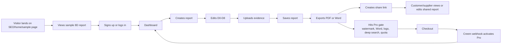
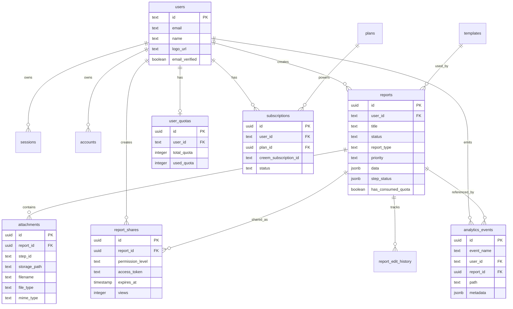

# 8D Reports Product Architecture

Last updated: 2026-06-02

This document describes the current 8D Reports product architecture based on the production codebase.

## Product Architecture Diagram

```mermaid
flowchart TB
  %% Users and channels
  subgraph Users["Users"]
    Visitor["Anonymous visitor"]
    FreeUser["Free user"]
    ProUser["Pro user"]
    SharedViewer["Shared report viewer/editor"]
    Operator["Product operator"]
  end

  subgraph Growth["Growth and discovery"]
    GoogleSearch["Google Search / Search Console"]
    BingSearch["Bing"]
    CommunityPosts["Community posts with UTM links"]
    SEOContent["SEO landing pages\n8D template, example, supplier 8D,\n5-Why, corrective action"]
    SampleReport["Sample report page"]
  end

  subgraph Vercel["Vercel production deployment"]
    Domain["www.8d-reports.com"]
    Analytics["Vercel Analytics"]
    CSP["Security headers / CSP"]
    NextApp["Next.js 16 App Router"]
    Proxy["proxy.ts\nlight auth pre-check"]
  end

  subgraph PublicPages["Public marketing pages"]
    Home["Home"]
    Pricing["Pricing"]
    FAQ["FAQ"]
    Docs["Docs"]
    Terms["Terms"]
    Privacy["Privacy"]
    Contact["Contact"]
  end

  subgraph AuthUI["Auth experience"]
    Login["Login"]
    Signup["Signup"]
    ResetPassword["Reset password"]
    AutoCheckout["Post-login auto checkout"]
  end

  subgraph AppUI["Authenticated app"]
    Dashboard["Dashboard\nreports, quota, search"]
    NewReport["New report"]
    Editor["Report editor\nD0-D8 forms"]
    AttachmentsUI["Attachment area\nphoto/library/file"]
    ExportUI["Export menu\nPDF / Word / ZIP"]
    ShareUI["Share dialog\nview/edit links"]
    QualityAgentUI["Quality expert chat"]
    SocialAgentUI["Social account agent"]
    FeedbackUI["Feedback widget"]
  end

  subgraph ShareExperience["Share experience"]
    SharePage["/share/[token]\nview or edit report"]
    SharedAttachmentAPI["Shared attachment file API"]
  end

  subgraph API["Next.js API routes"]
    AuthAPI["/api/auth/[...all]"]
    ReportsAPI["/api/reports\n/api/reports/[id]"]
    SearchAPI["/api/reports/search"]
    QuotaAPI["/api/quota"]
    UploadAPI["/api/upload"]
    AttachmentsAPI["/api/reports/[id]/attachments\n/api/attachments/[id]/file"]
    ExportAPI["/api/reports/[id]/export/docx"]
    ShareAPI["/api/reports/[id]/share\n/api/share/[token]"]
    CheckoutAPI["/api/checkout"]
    CreemWebhook["/api/webhooks/creem"]
    SubscriptionAPI["/api/subscription"]
    EventsAPI["/api/events"]
    FeedbackAPI["/api/feedback"]
    LogoAPI["/api/profile/logo"]
    QualityAgentAPI["/api/quality-agent\n/api/quality-agent/chat"]
    SocialAgentAPI["/api/social-account-agent"]
  end

  subgraph CoreLibs["Core libraries"]
    BetterAuth["Better Auth\nemail/password, OTP\nsocial login disabled in UI"]
    Drizzle["Drizzle ORM"]
    SubscriptionLib["Subscription gate\nFree vs Pro"]
    R2Lib["Cloudflare R2 S3 client"]
    CreemLib["Creem checkout client"]
    PdfLib["jsPDF PDF export"]
    WordLib["docx Word export"]
    ZipLib["JSZip attachment package"]
    AnalyticsLib["First-party event tracking"]
    I18n["next-intl messages"]
    RateLimit["Registration rate limit"]
  end

  subgraph Database["Neon Serverless Postgres"]
    UsersTable["users"]
    SessionsTable["sessions"]
    AccountsTable["accounts"]
    VerificationsTable["verifications"]
    ReportsTable["reports"]
    AttachmentsTable["attachments"]
    SharesTable["report_shares"]
    QuotasTable["user_quotas"]
    PlansTable["plans"]
    SubsTable["subscriptions"]
    EventsTable["analytics_events"]
    FeedbackTable["feedback"]
    TemplatesTable["templates"]
    EditHistoryTable["report_edit_history"]
    RateLimitTable["registration_rate_limits\nblocked_email_domains"]
  end

  subgraph External["External services"]
    GoogleOAuth["Google OAuth\nconfigured, UI hidden"]
    GitHubOAuth["GitHub OAuth\nconfigured, UI hidden"]
    Creem["Creem payments"]
    R2["Cloudflare R2\nattachments and logos"]
    DeepSeek["DeepSeek API\nreserved for AI features"]
    EmailProvider["Email provider / OTP path\ncurrently console OTP in code"]
  end

  subgraph Ops["Operations and metrics"]
    MetricsScript["scripts/metrics-dashboard.mjs"]
    MetricsHTML["metrics-dashboard.html"]
    GrowthPlaybook["docs/GROWTH_POSTING_PLAYBOOK.md"]
  end

  %% Discovery paths
  GoogleSearch --> SEOContent
  BingSearch --> SEOContent
  CommunityPosts --> SampleReport
  SEOContent --> SampleReport
  SEOContent --> Home
  SampleReport --> Login
  Home --> SampleReport
  Home --> Pricing
  Home --> Login

  %% Hosting
  Visitor --> Domain
  FreeUser --> Domain
  ProUser --> Domain
  SharedViewer --> Domain
  Domain --> NextApp
  NextApp --> Proxy
  NextApp --> PublicPages
  NextApp --> AuthUI
  NextApp --> AppUI
  NextApp --> ShareExperience
  NextApp --> API
  NextApp --> Analytics
  NextApp --> CSP

  %% Public pages
  PublicPages --> Home
  PublicPages --> Pricing
  PublicPages --> FAQ
  PublicPages --> Docs
  PublicPages --> Terms
  PublicPages --> Privacy
  PublicPages --> Contact

  %% Auth
  Login --> AuthAPI
  Signup --> AuthAPI
  ResetPassword --> AuthAPI
  AuthAPI --> BetterAuth
  BetterAuth --> Drizzle
  BetterAuth --> GoogleOAuth
  BetterAuth --> GitHubOAuth
  BetterAuth --> EmailProvider
  BetterAuth --> UsersTable
  BetterAuth --> SessionsTable
  BetterAuth --> AccountsTable
  BetterAuth --> VerificationsTable
  RateLimit --> RateLimitTable

  %% App flows
  Dashboard --> ReportsAPI
  Dashboard --> SearchAPI
  Dashboard --> QuotaAPI
  NewReport --> ReportsAPI
  Editor --> ReportsAPI
  Editor --> QualityAgentUI
  Editor --> SocialAgentUI
  Editor --> FeedbackUI
  AttachmentsUI --> UploadAPI
  AttachmentsUI --> AttachmentsAPI
  ExportUI --> PdfLib
  ExportUI --> ExportAPI
  ExportUI --> ZipLib
  ShareUI --> ShareAPI
  FeedbackUI --> FeedbackAPI
  QualityAgentUI --> QualityAgentAPI
  SocialAgentUI --> SocialAgentAPI

  %% API to libraries
  ReportsAPI --> Drizzle
  SearchAPI --> Drizzle
  QuotaAPI --> Drizzle
  UploadAPI --> R2Lib
  UploadAPI --> Drizzle
  AttachmentsAPI --> R2Lib
  AttachmentsAPI --> Drizzle
  ExportAPI --> WordLib
  ExportAPI --> Drizzle
  ShareAPI --> Drizzle
  CheckoutAPI --> CreemLib
  CreemWebhook --> Drizzle
  SubscriptionAPI --> Drizzle
  EventsAPI --> Drizzle
  FeedbackAPI --> Drizzle
  LogoAPI --> R2Lib
  LogoAPI --> Drizzle
  QualityAgentAPI --> DeepSeek
  SocialAgentAPI --> DeepSeek
  SubscriptionLib --> Drizzle

  %% Database tables
  Drizzle --> UsersTable
  Drizzle --> ReportsTable
  Drizzle --> AttachmentsTable
  Drizzle --> SharesTable
  Drizzle --> QuotasTable
  Drizzle --> PlansTable
  Drizzle --> SubsTable
  Drizzle --> EventsTable
  Drizzle --> FeedbackTable
  Drizzle --> TemplatesTable
  Drizzle --> EditHistoryTable

  %% Storage and payment
  R2Lib --> R2
  CreemLib --> Creem
  Creem --> CreemWebhook
  CreemWebhook --> SubsTable
  CreemWebhook --> EventsTable
  CheckoutAPI --> AutoCheckout
  Pricing --> CheckoutAPI

  %% Sharing
  SharePage --> ShareAPI
  SharePage --> SharedAttachmentAPI
  SharedAttachmentAPI --> R2Lib
  ShareAPI --> SharesTable
  ShareAPI --> ReportsTable
  ShareAPI --> AttachmentsTable

  %% Analytics and operations
  AnalyticsLib --> EventsAPI
  CheckoutAPI --> EventsAPI
  ExportUI --> AnalyticsLib
  ShareUI --> AnalyticsLib
  Dashboard --> AnalyticsLib
  MetricsScript --> Database
  MetricsScript --> MetricsHTML
  Operator --> MetricsHTML
  Operator --> Analytics
  Operator --> GrowthPlaybook
```

## Core User Flows

## Data Model Overview

## Main Architecture Notes

- Frontend and backend are in one Next.js 16 App Router application.
- Vercel hosts the production site and serves both static marketing pages and dynamic API routes.
- Better Auth handles email/password login, OTP verification, sessions, and auth cookies. Google/GitHub providers may remain configured, but the production UI currently hides those shortcuts until end-to-end login is stable.
- Neon Serverless Postgres is the system of record. Drizzle ORM maps application code to database tables.
- Cloudflare R2 stores report attachments and user company logos through S3-compatible APIs.
- Creem handles checkout and payment events. The webhook updates `subscriptions` and records `checkout_completed`.
- Free, Pro, and Team gates are enforced in both UI and API routes:
  - Free: 3 lifetime reports, PDF watermark, basic search, view-only sharing.
  - Pro: unlimited personal reports for individual use, no-watermark PDF, Word export, logo, editable sharing, deep search.
  - Team: 5-seat workspace, Owner / Editor / Viewer roles, approval statuses, locking, revisions, Activity Log, and Pro delivery features.
- PDF export is generated client-side with `jsPDF`; Word export is generated server-side with `docx`.
- ZIP export packages report files plus attachments with `JSZip`.
- Product analytics are first-party events stored in `analytics_events`; Vercel Analytics is used for anonymous traffic.
- DeepSeek-backed AI Quality Check and AI Draft are beta assistance tools. They do not approve or certify reports.
