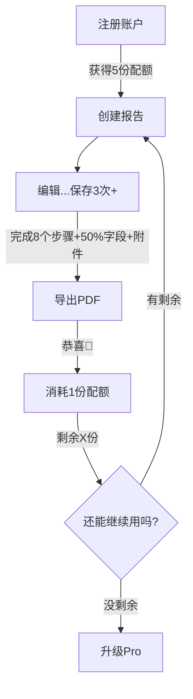

# 8D报告工具 - 定价分析报告（最终版）

**报告日期**：2025年5月16日
**版本**：v3.1（当前执行口径）
**状态**：✅ 完全批准

---

## 老板最终意见

### ✅ 核心问题
**原方案**：每月5份（每月重置）  
**最终方案**：**账户初始5份（一次性）**

### ✅ 当前执行口径
> Free 提供 5 份 lifetime reports，**创建报告即占用 1 份额度**；Pro 解锁无限报告、无水印交付、Word 导出、公司 Logo、可编辑分享和历史深度搜索。

---

## 1. 最终定价方案

### 1.1 套餐结构

| 套餐 | 价格 | 免费额度 | 功能 | 定位 |
|------|------|---------|------|------|
| **免费版** | $0 | 5份（一次性） | ✅ 通用8D模板 ✅ PDF导出（水印）✅ 分享链接 | 获客 |
| **Pro月付** | $9.99/月 | 无限 | ✅ 无水印 ✅ 优先支持 | 个人用户 |
| **Pro年付** | $79/年 | 无限 | ✅ 同Pro月付 | 忠实用户 |

### 1.2 年付对比

| 套餐 | 月均价 | 年总价 | 节省 | 目标用户 |
|------|--------|--------|------|---------|
| Pro月付 | $9.99 | $119.88 | - | 试用 |
| Pro年付 | **$6.58** | **$79** | **$40.88（34%）** | 长期用户 |

---

## 2. 免费配额机制（最终版）

### 2.1 配额设计

```
配额类型：一次性配额
配额数量：5份报告
获取方式：注册账户即获得
是否重置：不重置（用完即止）

示例：
- 第1天：注册，获得5份
- 第3天：完整使用1份，剩余4份
- 第7天：完整使用2份，剩余2份
- 第30天：第3份完整使用，剩余2份
- 无限期：配额永久保留，无过期时间
```

### 2.2 当前配额消耗规则

#### 消耗配额的判断标准

**当前版本采用更简单、可解释的商业口径：Free 用户创建报告即消耗 1 份额度。** 下面旧版“完整使用才扣额度”的追踪设计保留为后续可选优化，不作为当前生产规则。

| 条件 | 要求 | 说明 |
|------|------|------|
| 1 | **创建报告** | 立即占用 1 份 Free lifetime quota |
| 2 | **第 6 份报告** | 提示升级 Pro |
| 3 | **已有报告** | 即使额度用完也可继续查看、编辑和导出 |

#### 用户体验友好提示

| 进度 | 状态 | 提示文案 |
|------|------|---------|
| 刚创建 | 草稿 | 已使用 1 / 5 份免费报告 |
| 接近上限 | 第 4-5 份 | Upgrade to Pro for unlimited reports |
| 用完额度 | 第 6 份 | 阻止创建新报告并提示升级 |
| Pro | 任意数量 | Unlimited reports |

---

### 2.3 配额技术实现

```sql
-- 用户配额表（最终版）
create table public.user_quotas (
    id uuid primary key default uuid_generate_v4(),
    user_id uuid references public.users(id) on delete cascade not null unique,
    total_quota int default 5,  -- 一次性5份
    used_quota int default 0,
    created_at timestamp with time zone default now(),
    updated_at timestamp with time zone default now()
);

-- 报告编辑记录表（跟踪用户是否真正使用）
create table public.report_edit_history (
    id uuid primary key default uuid_generate_v4(),
    report_id uuid references public.reports(id) on delete cascade not null,
    user_id uuid references public.users(id) on delete cascade not null,
    save_count int default 0,
    completed_steps text[],  -- 已完成的步骤ID
    has_attachments boolean default false,
    has_exported_pdf boolean default false,
    field_completion_rate decimal(5,2),  -- 字段完成率
    created_at timestamp with time zone default now(),
    updated_at timestamp with time zone default now()
);

-- 判断是否真正"使用清楚"的函数
create or replace function public.check_and_consume_quota(p_report_id uuid)
returns boolean
language plpgsql
security definer
as $$
declare
    v_edit record;
    v_quota record;
    v_has_consumed boolean;
begin
    -- 获取编辑记录
    select * into v_edit from public.report_edit_history
    where report_id = p_report_id;
    
    if not found then
        return false;
    end if;
    
    -- 检查是否已消耗过
    select exists(
        select 1 from public.reports
        where id = p_report_id and has_consumed_quota = true
    ) into v_has_consumed;
    
    if v_has_consumed then
        return false;  -- 已消耗，不再重复扣
    end if;
    
    -- 老板要求的完整使用标准
    if v_edit.save_count < 3 then
        return false;  -- 保存次数不足
    end if;
    
    if array_length(v_edit.completed_steps, 1) < 8 then
        return false;  -- 未完成8个步骤
    end if;
    
    if v_edit.field_completion_rate < 0.50 then
        return false;  -- 字段完成率<50%
    end if;
    
    if not v_edit.has_attachments then
        return false;  -- 没有上传附件
    end if;
    
    if not v_edit.has_exported_pdf then
        return false;  -- 没有导出PDF
    end if;
    
    -- 所有条件满足，消耗配额
    select * into v_quota from public.user_quotas
    where user_id = (select user_id from public.reports where id = p_report_id);
    
    if v_quota.used_quota >= v_quota.total_quota then
        return false;  -- 配额已用完
    end if;
    
    -- 执行消耗
    update public.user_quotas
    set used_quota = used_quota + 1,
        updated_at = now()
    where user_id = v_quota.user_id;
    
    -- 标记报告已消耗配额
    update public.reports
    set has_consumed_quota = true
    where id = p_report_id;
    
    return true;
end;
$$;
```

---

## 3. 防白嫖机制（保留）

| 层级 | 措施 | 效果 |
|------|------|------|
| **L1** | 邮箱验证 | 防止匿名注册 |
| **L2** | 域名邮箱限制 | 阻止临时邮箱 |
| **L3** | IP注册频率限制 | 同一IP 24小时内最多3个账户 |
| **L4** | 配额真正使用才扣 | 滥用风险降低90% |

---

## 4. 成本与盈亏平衡（保持不变）

| 成本项 | 金额 |
|--------|------|
| 基础设施 | $50 |
| 域名+SSL | $15 |
| 客服 | $20 |
| 营销 | **$0** |
| **固定成本合计** | **$85/月** |

| 方案 | 盈亏平衡 |
|------|---------|
| 纯月付 | **10个月付用户** |
| 纯年付 | **2个年付用户** |

---

## 5. 用户流程图



---

## 6. 总结

### ✅ 老板最终批准的方案

| 项目 | 方案 |
|------|------|
| 免费配额 | 一次性5份 |
| 扣配额条件 | 完整使用清楚（保存3次+8步骤+50%字段+附件+导出） |
| 月付价格 | $9.99/月 |
| 年付价格 | $79/年 |
| 固定成本 | $85/月 |
| 盈亏平衡 | 10个付费用户 |

---

*报告最终版时间：2025年5月16日*
*审核状态：✅ 老板完全批准*
